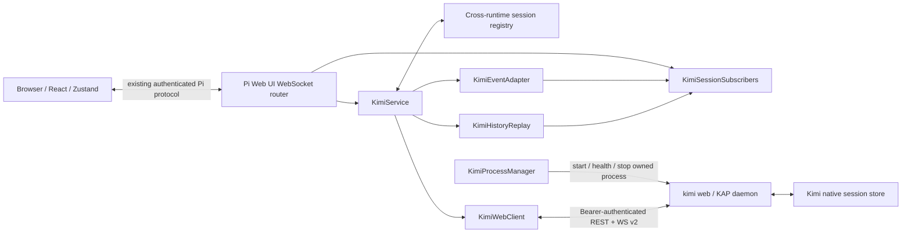

# Kimi Code Runtime Feasibility and Integration Design

> **Status:** research complete; integration proposed but not implemented
>
> **Decision:** proceed with a `kimi web` / Kimi Agent Protocol (KAP) adapter when implementation is prioritised
>
> **Validated against:** Kimi Code `0.31.0`, source commit [`ed7a4cc`](https://github.com/MoonshotAI/kimi-code/commit/ed7a4cc095e1619e4dbb6c2c77c89a52e312b085), on 2026-07-31
>
> **Recommended Pi Web UI precedent:** [`server/src/opencode/`](../server/src/opencode/)
>
> **Implementation checklist:** [`ADDING-A-RUNTIME.md`](./ADDING-A-RUNTIME.md)

This document records the feasibility research, local runtime experiments, architectural decision, risks, and proposed delivery plan for adding the renewed [MoonshotAI Kimi Code](https://github.com/MoonshotAI/kimi-code) CLI as a fifth Pi Web UI runtime alongside Pi Coding Agent, Claude Code, OpenCode, and Antigravity.

It is deliberately a **prospective design document**, not a statement that Kimi support is already shipped. When implementation begins, code and emitted runtime contracts take precedence over this research according to [`DOCS-GOVERNANCE.md`](./DOCS-GOVERNANCE.md).

## Executive summary

Kimi Code is a strong candidate for a native-quality fifth runtime. The renewed TypeScript CLI exposes substantially better programmatic integration surfaces than the Antigravity print-mode path:

- structured, streaming assistant and thinking deltas;
- structured tool invocation, progress, results, retries, approvals, and questions;
- long-lived multi-session operation;
- native session persistence and structured transcript reconstruction;
- authenticated REST and WebSocket APIs;
- cursor-based reconnect, snapshots, and explicit resynchronisation;
- abort, prompt steering, model selection, usage, compaction, and subagent events.

The recommended primary architecture is:

> Run one Pi-Web-UI-managed, loopback-only `kimi web` daemon and add an OpenCode-style Kimi service, process manager, authenticated REST/WebSocket client, event adapter, history replay adapter, and subscriber fan-out layer.

Kimi's own session store and transcript should remain the authority for native state. Pi Web UI's session registry should own only the cross-runtime mapping and Pi-specific metadata. Live events should be projected into the existing `NormalizedEvent` pipeline, while richer native envelopes are preserved in bounded diagnostics until shared product semantics exist for them.

The alternatives are weaker:

- `kimi acp` is a credible, standardised backend for newly created ACP sessions but currently exposes a reduced projection of Kimi's native lifecycle; it is not a proven migration path for a KAP-created session.
- `kimi -p --output-format stream-json` preserves final content and tool records but is not granular enough for the primary interactive runtime and has a known stdout-shutdown risk.
- the internal Node SDK offers ideal access but is marked private and is not a stable published dependency.
- the legacy Python `kimi-cli` and its `--wire` mode belong to the predecessor project that Moonshot says [will be gradually wound down](https://github.com/MoonshotAI/kimi-cli#readme); it must not be used as the target.

The local K2.7 validation showed that `kimi web` can preserve the ordered sequence of thinking, tool call, tool result, further thinking, and final assistant text. The final assistant content was reproduced exactly. Pi Web UI can therefore preserve the **semantic and textual fidelity** of the native Kimi session, even though it will render that content using Pi Web UI components rather than byte-for-byte terminal chrome.

## 1. Research question and decision criteria

The investigation asked:

1. Is the renewed Kimi Code CLI technically suitable for a first-class Pi Web UI runtime?
2. Which supported integration surface offers the best combination of fidelity, safety, durability, and maintainability?
3. Can Pi Web UI preserve the native information in the Kimi terminal transcript supplied for this investigation (not retained in the repository), especially reasoning, tools, results, ordering, and exact assistant text?
4. How should Kimi process and session ownership fit Pi Web UI's existing runtime-neutral architecture?
5. What compatibility and security controls are necessary because Kimi Code is pre-1.0?

The architectural priorities were, in order:

1. **content fidelity:** no terminal scraping and no premature loss of structured Kimi events;
2. **correct interactive lifecycle:** streaming, abort, approvals, questions, and exactly one terminal completion;
3. **durable replay:** browser refresh and server restart must reconstruct authoritative history;
4. **runtime isolation:** credentials and native APIs remain behind the Pi Web UI server boundary;
5. **maintainability:** prefer supported and machine-described contracts over undocumented internals;
6. **runtime neutrality:** avoid making the frontend a Kimi-specific client where shared semantics are sufficient;
7. **compatibility detection:** fail closed when an installed Kimi version no longer satisfies the expected contract.

## 2. Method and evidence

The findings combine four evidence sources:

1. the current Pi Web UI architecture and runtime-integration documentation;
2. the installed Kimi binaries and their command help;
3. the official Kimi Code repository, documentation, source code, schemas, and issue tracker;
4. bounded local executions using the existing Kimi authentication and the K2.7 Coding model.

The principal Pi Web UI materials reviewed were:

- [`ADDING-A-RUNTIME.md`](./ADDING-A-RUNTIME.md)
- [`ARCHITECTURE.md`](./ARCHITECTURE.md)
- [`EVENT-PIPELINE.md`](./EVENT-PIPELINE.md)
- [`PROTOCOL.md`](./PROTOCOL.md)
- [`OPENCODE-DIRECT-INTEGRATION.md`](./OPENCODE-DIRECT-INTEGRATION.md)
- [`ANTIGRAVITY-INTEGRATION.md`](./ANTIGRAVITY-INTEGRATION.md)
- [`INTERNAL-API.md`](./INTERNAL-API.md)
- [`LIVE-VALIDATION.md`](./LIVE-VALIDATION.md)
- [`SECURITY.md`](../SECURITY.md)

The Kimi source checkout used for code-level verification was commit [`ed7a4cc095e1619e4dbb6c2c77c89a52e312b085`](https://github.com/MoonshotAI/kimi-code/commit/ed7a4cc095e1619e4dbb6c2c77c89a52e312b085). The repository is MIT licensed. The installed renewed CLI reported version `0.31.0`. Source links below use the convenient mutable `main` view unless the commit is shown explicitly; reproducibility claims refer to the pinned commit, and later `main` content must not be assumed to match the evaluated checkout.

The tests were intentionally small:

- a marker file was created in a disposable temporary working directory;
- Kimi was asked to use its `Read` tool and return a fixed marker;
- no destructive tool was requested;
- K2.7 Coding was used; K3 was not used;
- native test sessions were archived afterwards;
- no Kimi credentials, bearer tokens, session records, or transcript files were copied into this repository.

These tests establish feasibility and normal-flow fidelity. They do **not** replace the reconnect, approval, cancellation, compaction, concurrency, and restart validation required before shipping.

## 3. The two installed Kimi generations

A potentially confusing discovery is that two unrelated generations are installed and their version numbers do not indicate which is newer.

| Binary | Observed version | Project generation | Relevance |
|---|---:|---|---|
| `~/.kimi-code/bin/kimi` | `0.31.0` | Renewed TypeScript [`MoonshotAI/kimi-code`](https://github.com/MoonshotAI/kimi-code) | **Target this runtime** |
| `~/.local/bin/kimi-cli` | `1.47.0` | Legacy Python [`MoonshotAI/kimi-cli`](https://github.com/MoonshotAI/kimi-cli) | Do not target |

A bundled copy of the renewed CLI was also present through the installed Kimi editor tooling. The standalone `~/.kimi-code/bin/kimi` was used for validation.

The older Python CLI exposed an experimental `--wire` mode, but the renewed TypeScript CLI has a different architecture and does not offer that option. Moonshot's legacy repository says the project is evolving into Kimi Code and will be gradually wound down, so a design based on `kimi-cli --wire` would integrate the wrong generation and inherit a deprecated direction.

The renewed project includes these relevant applications and packages:

- [`apps/kimi-code`](https://github.com/MoonshotAI/kimi-code/tree/main/apps/kimi-code) — CLI/TUI, print mode, and ACP entry point;
- [`apps/kimi-web`](https://github.com/MoonshotAI/kimi-code/tree/main/apps/kimi-web) — Kimi's own browser client and daemon launcher;
- [`packages/kap-server`](https://github.com/MoonshotAI/kimi-code/tree/main/packages/kap-server) — authenticated REST/WebSocket server;
- [`packages/acp-adapter`](https://github.com/MoonshotAI/kimi-code/tree/main/packages/acp-adapter) — Agent Client Protocol adapter;
- [`packages/node-sdk`](https://github.com/MoonshotAI/kimi-code/tree/main/packages/node-sdk) — internal programmatic harness API;
- [`packages/agent-core`](https://github.com/MoonshotAI/kimi-code/tree/main/packages/agent-core) — native event and execution engine.

## 4. Integration surfaces evaluated

### 4.1 Print mode: `kimi -p`

The official [Kimi command reference](https://moonshotai.github.io/kimi-code/en/reference/kimi-command.html) supports non-interactive prompting and session continuation. The programmatic form relevant to this evaluation is:

```bash
kimi -p "<prompt>" --output-format stream-json
```

The print renderer is implemented in:

- [`run-prompt.ts`](https://github.com/MoonshotAI/kimi-code/blob/main/apps/kimi-code/src/cli/run-prompt.ts)
- [`prompt-render.ts`](https://github.com/MoonshotAI/kimi-code/blob/main/apps/kimi-code/src/cli/prompt-render.ts)
- [`headless-exit.ts`](https://github.com/MoonshotAI/kimi-code/blob/main/apps/kimi-code/src/cli/headless-exit.ts)

#### Observed behaviour

A tool-using K2.7 turn produced simple JSON Lines records equivalent to:

1. an assistant record containing the structured function/tool call;
2. a tool record containing `tool_call_id` and exact result content;
3. an assistant record containing final response content;
4. a session resume hint containing the native Kimi session identifier.

The assistant tool-call structure follows an OpenAI-like shape:

```json
{
  "role": "assistant",
  "tool_calls": [
    {
      "type": "function",
      "id": "<tool-call-id>",
      "function": {
        "name": "Read",
        "arguments": "<JSON string>"
      }
    }
  ]
}
```

Tool results use:

```json
{
  "role": "tool",
  "tool_call_id": "<tool-call-id>",
  "content": "<tool output>"
}
```

Provider retry information may appear as a `role: "meta"`, `type: "turn.step.retrying"` record. This is useful for bounded scripts and smoke tests.

The native session ID from the resume hint successfully resumed a second turn. The selected model could be controlled using the K2.7 alias `kimi-code/kimi-for-coding`.

#### Fidelity limitations

Print stream-JSON is a **message projection**, not Kimi's full live event stream:

- assistant deltas are accumulated before an assistant JSON record is written;
- thinking deltas are intentionally ignored by the JSON writer;
- several native lifecycle events are not represented;
- print mode temporarily forces a headless permission mode suitable for non-interactive execution;
- a subprocess must initialise and close a harness for each invocation;
- the consumer must coordinate resume IDs and process exit correctly.

Plain text mode is even less suitable as an API. It deliberately renders terminal blocks with a bullet and indentation, writes assistant text to stdout, and writes thinking and resume guidance to stderr. Terminal wrapping can alter the visible representation. Parsing that output would recreate the brittle behaviour the Kimi API surfaces are designed to avoid.

There is also an open upstream reliability concern: [MoonshotAI/kimi-code issue #1897](https://github.com/MoonshotAI/kimi-code/issues/1897) reports that `stream-json` can lose the trailing assistant record and session hint under stdout backpressure when shutdown signals terminate the process before the pipe drains. Whether every current environment reproduces it or not, it is an unnecessary risk for a primary interactive runtime.

#### Decision

Use print stream-JSON only for:

- installation smoke tests;
- diagnostic commands;
- a narrowly scoped emergency tool, if explicitly labelled as degraded;
- compatibility fixtures for final assistant/tool record shapes.

Do not use it as Pi Web UI's normal Kimi transport.

### 4.2 Agent Client Protocol: `kimi acp`

Kimi provides an official [ACP integration](https://moonshotai.github.io/kimi-code/en/reference/kimi-acp.html) over JSON-RPC on stdio. ACP is intended for editors and custom clients, and is therefore a much stronger integration boundary than terminal print parsing.

The local `initialize` exchange completed cleanly:

- stdout contained the JSON-RPC response without banner noise;
- stderr was empty;
- protocol version 1 was negotiated;
- the agent identified itself as Kimi Code `0.31.0`;
- capabilities advertised session loading, listing, and resumption;
- image and embedded-context support were advertised;
- MCP HTTP and SSE transport support were advertised.

The Kimi ACP adapter implements:

- `session/new`;
- `session/load`;
- `session/resume`;
- `session/list`;
- prompt dispatch;
- cancellation;
- model and thinking-mode configuration;
- assistant and thought chunks;
- tool calls and updates;
- permission/approval exchanges.

Its event mapping can be inspected in [`packages/acp-adapter/src/events-map.ts`](https://github.com/MoonshotAI/kimi-code/blob/main/packages/acp-adapter/src/events-map.ts).

A Pi Web UI ACP client could advertise no client filesystem capabilities. Kimi would then execute its own local file tools rather than asking Pi Web UI to proxy each file operation. That preserves the established runtime trust boundary: Kimi runs under the server user's workspace permissions, while browser clients remain remote views/controllers.

#### ACP advantages

- public, standardised protocol intended for third-party clients;
- one long-lived process can host multiple sessions;
- straightforward stdio process containment;
- no daemon bearer token or TCP port management;
- good baseline coverage for text, thought, tools, cancellation, and permissions;
- potentially reusable ACP infrastructure if Pi Web UI later supports other ACP agents.

#### ACP limitations observed in Kimi 0.31.0

The current adapter intentionally projects Kimi's richer native model into ACP. Compared with KAP/WebSocket events:

- some fine-grained tool progress is not forwarded;
- explicit Kimi compaction events are not fully represented;
- retry, task, goal, and subagent semantics are reduced;
- replay and snapshot semantics are not as rich as Kimi's transcript service;
- future Kimi-specific event types may have no ACP equivalent.

ACP could preserve normal assistant/thinking/tool flows very well, but it does not currently meet the strongest interpretation of “preserve everything native Kimi knows about the turn”.

#### Decision

Keep ACP as:

1. a documented backend for **newly created ACP sessions** if the KAP server contract is unavailable or incompatible;
2. a future selectable backend with explicit capability labels;
3. a candidate for eventual promotion if Kimi's ACP adapter reaches parity for replay, progress, compaction, approvals, and subagents.

Do not silently migrate an existing KAP-backed session to ACP. Cross-backend native-session interoperability was not established, and the loss of event semantics would be invisible even if loading happened to work. Migration may be offered only after explicit compatibility tests prove identity, transcript, and pending-interaction safety.

### 4.3 Kimi Web / Kimi Agent Protocol server

Running:

```bash
kimi web --no-open --host 127.0.0.1 --port <loopback-port>
```

Kimi 0.31.0 defaults to `127.0.0.1` when `--host` is omitted, but Pi Web UI should pass the address explicitly and verify the actual listener before treating the daemon as ready. It must never use bare `--host`, which means `0.0.0.0`, or `--dangerous-bypass-auth`.

starts a long-lived Kimi Agent Protocol server plus Kimi's own browser client. The server is implemented in [`packages/kap-server`](https://github.com/MoonshotAI/kimi-code/tree/main/packages/kap-server), while the first-party client is in [`apps/kimi-web`](https://github.com/MoonshotAI/kimi-code/tree/main/apps/kimi-web).

The [Kimi Web README](https://github.com/MoonshotAI/kimi-code/blob/main/apps/kimi-web/README.md) describes the browser UI as a peer interface to the terminal UI, using the same underlying agent core. This is the most important architectural observation: Pi Web UI would not be scraping another user interface. It would become another server-side KAP client over the same native execution engine.

#### Observed server contract

The locally started 0.31.0 server exposed:

- an authenticated OpenAPI 3.0.3 document;
- 72 REST paths in the inspected contract;
- an authenticated AsyncAPI 3.1.0 document;
- a WebSocket protocol with versioned control messages;
- bearer-token authentication;
- health and metadata endpoints;
- session, workspace, model, prompt, approval, question, task, terminal, filesystem, skill, transcript, snapshot, and export surfaces.

Important route families included:

```text
GET/POST  /api/v1/workspaces
GET/POST  /api/v1/sessions
GET       /api/v1/sessions/:id/status
GET       /api/v1/sessions/:id/snapshot
GET       /api/v1/sessions/:id/messages
GET       /api/v1/sessions/:id/transcript
GET       /api/v1/sessions/:id/transcript/ops
GET/POST  /api/v1/sessions/:id/prompts
POST      /api/v1/sessions/:id:abort
POST      /api/v1/sessions/:id/prompts:steer
GET/POST  /api/v1/sessions/:id/approvals
GET/POST  /api/v1/sessions/:id/questions
GET       /api/v1/models
GET       /api/v1/meta
GET       /api/v1/healthz
```

Exact path and body shapes must always be taken from the installed server's schemas rather than copied permanently from this document. Kimi uses action-style paths in several places, and the generated OpenAPI representation may normalise action suffixes internally.

#### Live event model

The KAP server exposes raw agent-core events such as:

- `turn.started` and `turn.ended`;
- `turn.step.started` and step completion/retry events;
- `thinking.delta`;
- `assistant.delta`;
- `tool.call.started` and argument deltas;
- `tool.progress`;
- `tool.result`;
- approval and question events;
- usage/status changes;
- compaction events;
- task, goal, and subagent lifecycle events.

The schemas are defined in [`events-zod.ts`](https://github.com/MoonshotAI/kimi-code/blob/main/packages/kap-server/src/protocol/events-zod.ts). Kimi's own transcript projector demonstrates how native events become durable turn/step/frame records in [`coreEventMap.ts`](https://github.com/MoonshotAI/kimi-code/blob/main/packages/kap-server/src/services/transcript/coreEventMap.ts).

#### Durability and reconnect model

KAP distinguishes durable events from volatile text/thinking deltas. Its protocol includes:

- durable sequence numbers;
- an epoch identifying the current server event generation;
- volatile offsets for accumulated streaming text;
- snapshot state for a currently running turn;
- cursor-based catch-up;
- explicit `resync_required` handling;
- structured transcript snapshots and transcript operation journals.

The relevant contracts are:

- [`ws-control.ts`](https://github.com/MoonshotAI/kimi-code/blob/main/packages/kap-server/src/protocol/ws-control.ts)
- [`rest-snapshot.ts`](https://github.com/MoonshotAI/kimi-code/blob/main/packages/kap-server/src/protocol/rest-snapshot.ts)
- [`transcript.ts`](https://github.com/MoonshotAI/kimi-code/blob/main/packages/kap-server/src/routes/transcript.ts)

This directly addresses one of Pi Web UI's hardest runtime problems: reconnecting during a turn without losing already-streamed output or replaying terminal events twice.

#### Session and transcript authority

Kimi persists native sessions under its own data home. The official [data-location documentation](https://moonshotai.github.io/kimi-code/en/configuration/data-locations.html) and [session guide](https://moonshotai.github.io/kimi-code/en/guides/sessions.html) should be treated as the operator reference.

The transcript route has two important behaviours:

- for a live session, it reads the in-memory transcript and awaits native history backfill;
- for a cold session, it rebuilds the requested agent transcript from persisted wire records.

This makes Kimi's transcript the correct authority for both live and restored history. Pi Web UI should not reconstruct cold history by parsing terminal output or by relying solely on browser-era normalized events.

#### Authentication and daemon discovery

`kimi web` uses a bearer token persisted in `~/.kimi-code/server.token`. The local file was owner-only (`0600`). The token is part of the daemon's trust boundary and must never be:

- returned to the browser;
- copied into the cross-runtime session registry;
- included in diagnostics or request logs;
- committed to the repository;
- exposed through health or capability responses.

The daemon supports loopback operation and can select another port when the requested one is occupied. Multiple Kimi server instances may share the same Kimi data home. Pi Web UI must therefore distinguish:

- a daemon it started and may stop;
- an explicitly configured external daemon it may attach to but must not stop;
- unrelated user-owned Kimi processes it must ignore.

#### Decision

KAP is the recommended primary surface because its schemas and source expose native event fidelity, durable replay, interactive controls, and multi-session operation, while the normal tool-using live/replay path was validated locally. Approval, cancellation, reconnect, resync, restart, compaction, and concurrency support were source/schema-observed but were not end-to-end validated in this feasibility run.

### 4.4 Internal Node SDK

The monorepo contains an attractive direct API around `createKimiHarness`, sessions, events, models, and prompts. Its README and example demonstrate the shape Pi Web UI would want:

- [`packages/node-sdk/README.md`](https://github.com/MoonshotAI/kimi-code/blob/main/packages/node-sdk/README.md)
- [`kimi-harness-prompt-demo.ts`](https://github.com/MoonshotAI/kimi-code/blob/main/packages/node-sdk/examples/kimi-harness-prompt-demo.ts)
- [`events.ts`](https://github.com/MoonshotAI/kimi-code/blob/main/packages/node-sdk/src/events.ts)
- [`session.ts`](https://github.com/MoonshotAI/kimi-code/blob/main/packages/node-sdk/src/session.ts)

However, `@moonshot-ai/kimi-code-sdk` was marked `"private": true` and was not available as a separately published npm dependency during the evaluation. Depending on it would require vendoring Kimi internals, building from the monorepo, or importing implementation files outside a supported package contract.

That would create unnecessary coupling to Kimi's build graph and release process. The SDK should be reconsidered only if Moonshot publishes and versions it as a supported external package.

## 5. K2.7 validation results

### 5.1 Model selection

The safe test model was selected using:

```text
kimi-code/kimi-for-coding
```

The native session/wire records identified the provider model as:

```text
kimi-for-coding
```

This confirmed that the test used K2.7 Coding. K3 was intentionally not used.

### 5.2 Print-mode test

The prompt asked Kimi to read a temporary marker file and return the marker exactly. Results:

- Kimi invoked the native `Read` tool;
- stream-JSON retained the tool name and exact argument JSON;
- the tool result was retained;
- the final assistant content matched the required marker;
- the resume hint supplied a native session ID;
- a follow-up invocation resumed the same session successfully.

Text output mode showed why it must not be parsed as an API:

- final display text was written to stdout with TUI bullet formatting;
- reasoning and resume guidance were written to stderr;
- rendering and content are deliberately separate concerns.

### 5.3 KAP test

A second disposable test created a workspace and session through `kimi web`, dispatched a K2.7 prompt, consumed live events, and retrieved the persisted transcript.

The authoritative transcript retained this order:

1. initial thinking frame;
2. `Read` tool invocation and structured input;
3. tool result frame;
4. second thinking frame;
5. final assistant text frame.

The exact final response was:

```text
WEB_MARKER: VERBATIM_WEB_9c21
```

The result is significant because the final value was found in both the live event stream and the structured persisted transcript. It was not recovered from terminal rendering.

### 5.4 ACP handshake test

A local ACP `initialize` request demonstrated:

- clean JSON-RPC framing on stdout;
- no incidental stderr output;
- protocol version negotiation;
- Kimi Code version/capability identification;
- support for load/list/resume and richer prompt capabilities.

A complete ACP tool/replay comparison was not necessary to choose the primary architecture because source inspection already showed that the KAP event surface is a superset for Kimi-specific semantics. ACP should still receive its own end-to-end fixture suite before being offered as a backend for newly created sessions.

### 5.5 Test limitations

The feasibility run did not establish all production guarantees. It did not fully test:

- manual approval and rejection;
- structured question responses;
- cancellation while a tool is active;
- provider retry during partial output;
- cursor expiry and forced `resync_required`;
- daemon restart during a turn;
- epoch rollover;
- simultaneous browser subscribers;
- concurrent turns against one native session;
- compaction and post-compaction replay;
- subagent rendering;
- very large tool results or transcripts;
- binary/image/attachment handling;
- Windows or macOS process management.

These are delivery acceptance tests, not reasons to reject the integration.

## 6. What “native fidelity” should guarantee

The visual example that motivated this research contains several different notions of fidelity. They should be separated explicitly.

### 6.1 Content fidelity — required

For the KAP backend, Pi Web UI should guarantee that it preserves:

- final assistant text exactly as supplied by Kimi;
- thinking/reasoning text exactly as supplied by Kimi, subject to user visibility settings;
- ordering between thinking, assistant text, tool calls, results, and subsequent reasoning;
- tool names and native call identifiers;
- structured arguments without lossy reparsing where the source is structured;
- tool output, error content, and status;
- turn completion reason and runtime error state;
- native session identity and model selection;
- replayed transcript content across browser and Pi Web UI restarts.

### 6.2 Semantic fidelity — required

Pi Web UI should also preserve the meaning of native lifecycle events:

- a started tool remains visibly running until result or cancellation;
- an approval remains pending until answered, cancelled, or expired;
- a failed/retried step does not leak discarded partial assistant output as final text;
- abort is distinct from successful completion;
- exactly one terminal Pi `agent_end` is emitted for each accepted turn;
- replay and live continuation converge to the same rendered transcript;
- subagent events are not misrepresented as main-agent messages.

### 6.3 Presentation fidelity — intentionally different

Pi Web UI should **not** try to reproduce the Kimi terminal screen byte-for-byte. Native TUI details such as bullets, ANSI colour, wrapping, `ctrl+o` hints, expandable terminal cards, and cursor placement belong to Kimi's terminal renderer.

The browser should render the same underlying content using Pi Web UI's runtime-neutral message and tool components. A Kimi-specific presentation enhancement is justified only where the shared UI cannot express a meaningful native concept.

### 6.4 Raw protocol fidelity — bounded preservation

Not every Kimi event needs an immediate public Pi protocol type. Unknown and richer native events should be retained in a bounded, redacted diagnostic projection so that:

- adapter bugs can be diagnosed;
- future Kimi event additions are not silently invisible;
- a later shared protocol extension can be implemented from evidence;
- Pi Web UI does not turn every runtime-specific field into permanent frontend coupling.

This diagnostic preservation is not permission to persist unrestricted tool payloads or secrets. Existing Pi Web UI observability bounds and redaction rules still apply.

## 7. Recommended architecture



### 7.1 Architectural decision

Implement a new runtime family under `server/src/kimi/`, structurally following OpenCode rather than Antigravity:

```text
server/src/kimi/
├── kimi-types.ts
├── kimi-process-manager.ts
├── kimi-client.ts
├── kimi-service.ts
├── kimi-event-adapter.ts
├── kimi-history-replay.ts
└── kimi-session-subscribers.ts
```

Optional focused modules may be added for schema validation, cursor state, or compatibility probing, but the integration should not become a second generic runtime framework before the Kimi path proves the need.

### 7.2 Responsibilities

#### `KimiProcessManager`

- locate the renewed `kimi` binary and reject the legacy `kimi-cli` binary;
- start one owned `kimi web --no-open --host 127.0.0.1` daemon lazily;
- verify the actual listener is loopback before readiness succeeds;
- request a configured or ephemeral port and discover the actual selected port;
- wait for authenticated readiness with a bounded startup timeout;
- retain child PID and ownership identity;
- distinguish owned and explicitly external daemon modes;
- stop only an owned daemon during server shutdown;
- never kill a process solely because it uses the same Kimi data home;
- surface bounded, redacted startup diagnostics.

#### `KimiWebClient`

- attach the bearer token only to server-to-server requests;
- implement typed REST calls for metadata, models, workspaces, sessions, prompts, abort, steer, approvals, questions, snapshots, and transcripts;
- implement WebSocket v2 control and event envelopes;
- enforce request timeouts and response-size bounds;
- redact authentication and potentially sensitive payloads in errors;
- expose compatibility information independently of generic availability;
- treat malformed required payloads as a contract failure, not as empty success.

#### `KimiService`

- create, restore, and map sessions;
- coordinate prompt admission and busy state;
- subscribe before or atomically with dispatch so early events are not lost;
- reconcile snapshot state with live events;
- route abort, approval, question, and steering operations;
- feed browser-originated and Internal-API-originated events through the same observer path;
- implement pin/unpin semantics without pretending Pi owns native persistence;
- guarantee exactly one terminal completion callback;
- expose runtime health, model catalogue, and setup validation.

#### `KimiEventAdapter`

- validate incoming native envelopes;
- preserve the Kimi ordering implied by the stream and transcript;
- map supported events to `NormalizedEvent`;
- maintain per-turn state needed to avoid duplicate starts/ends;
- prevent retry-discarded text from becoming final output;
- map runtime errors and cancellation truthfully;
- retain unknown event metadata only through bounded/redacted diagnostics;
- never stringify structured tool arguments merely to parse them again downstream.

#### `KimiHistoryReplay`

- load Kimi's structured transcript rather than terminal output;
- rebuild user, assistant, thinking, tool-call, tool-result, and lifecycle projections in order;
- reconcile a live in-flight snapshot with durable completed turns;
- preserve native identifiers needed to match a replayed tool with later live progress;
- emit the same normalized semantic sequence expected from a live session;
- avoid replaying `agent_end` in a way that falsely completes a newer live turn.

#### `KimiSessionSubscribers`

- support multiple Pi Web UI browser tabs or API observers viewing one Kimi session;
- keep runtime execution independent of a particular browser socket;
- make late subscribers receive replay/snapshot before new live events;
- release listeners when the final subscriber leaves without aborting Kimi;
- prevent listener accumulation across switch, reconnect, and unload flows.

### 7.3 Process ownership model

The default should be one KAP daemon per Pi Web UI server and configured Kimi home, not one process per prompt and not one process per session.

A process record should distinguish:

```typescript
type KimiDaemonOwnership =
  | {
      kind: 'managed';
      pid: number;
      endpoint: string;
      binaryPath: string;
      spawnedAt: string;
      ownershipNonce: string;
    }
  | { kind: 'external'; endpoint: string };
```

The exact type is illustrative. Credentials must not be embedded in this record if it can reach diagnostics or persisted session metadata. A PID and endpoint alone are not sufficient because PIDs can be reused.

A managed daemon should be lazily created on first health/model/session use and reused across Kimi sessions. The manager should use a private, atomic Pi-Web-UI-specific ownership lock containing at least PID, process start identity where the platform exposes it, binary/command identity, endpoint, and a random ownership nonce. Before signalling a recovered PID, it must verify the live process still matches the lock; on platforms without a trustworthy identity check, a stale lock must fail closed rather than risk killing an unrelated process. The retained child handle is authoritative during the same Pi Web UI process lifetime. The lease must not block ordinary Kimi TUI use or imply ownership of unrelated Kimi processes.

External attachment should require explicit operator configuration. Pi Web UI should not scan local ports and adopt whichever Kimi server responds. External endpoints must be parsed and validated fail-closed; the initial implementation should accept loopback endpoints only unless a separately designed TLS/authenticated remote mode is approved.

### 7.4 Session ownership model

Kimi owns:

- the native session identifier;
- prompt/turn execution;
- transcript and wire records;
- tool and approval state;
- model and agent configuration;
- persisted resumption state.

Pi Web UI owns:

- its internal cross-runtime session ID;
- the `sdkType: "kimi"` registry entry;
- the mapping to the native Kimi session ID;
- UI title/runtime metadata;
- subscription state;
- bounded replay/cursor checkpoints;
- run receipts, watches, notifications, and Pi-specific pinning metadata.

The registry is authoritative for cross-runtime lookup but is not a duplicate Kimi transcript store.

Suggested registry metadata includes:

- native Kimi session ID;
- workspace root or stable workspace mapping;
- backend (`kap`, and later optionally `acp`);
- configured runtime instance identity;
- selected model and thinking level where known;
- last observed Kimi version/protocol compatibility;
- archived/deleted status where supported;
- last known busy/terminal state.

Secrets, bearer tokens, raw prompts, and unbounded native events must not enter the registry.

## 8. Runtime flows

### 8.1 Availability and startup

1. Locate `kimi` and run a bounded version probe.
2. Reject an incompatible binary with a clear distinction between renewed `kimi` and legacy `kimi-cli`.
3. Start or connect to the configured daemon mode.
4. Wait for health readiness.
5. authenticate and fetch metadata plus API contracts/capabilities;
6. verify required KAP and WebSocket features;
7. publish runtime availability and compatibility status to Pi Web UI.

Availability should not mean merely “a process answered”. A Kimi runtime is available only when required authenticated session, prompt, snapshot, transcript, abort, and WS v2 capabilities pass validation.

### 8.2 Session creation

1. Apply Pi Web UI auth, CSRF/origin, request-bound, cwd, and prompt-injection protections.
2. Resolve or create a Kimi workspace for the validated cwd.
3. Create a native Kimi session using the requested supported model/thinking configuration.
4. Create the Pi Web UI registry entry containing the native mapping.
5. establish subscriber/cursor state;
6. return the Pi internal session ID to the browser.

Creation must fail closed if the Kimi session exists but the registry write cannot be made durable. Recovery logic may later reconcile an orphaned native session, but the initial response must not claim a usable Pi session without the mapping.

### 8.3 Prompt dispatch

1. Authenticate and validate the Pi request.
2. Resolve the registry entry and configured runtime instance.
3. Check Kimi's authoritative status rather than only an in-memory `isRunning` flag.
4. Obtain a baseline snapshot/cursor and ensure WS subscription coverage.
5. dispatch the prompt through REST;
6. map live Kimi events into the common pipeline;
7. update run receipts and API observers from the same source;
8. on Kimi terminal state, emit exactly one Pi `agent_end` and clear busy state.

If REST accepts a prompt but the WebSocket disconnects immediately, the operation remains accepted. Recovery must inspect Kimi status/snapshot/transcript rather than converting transport loss into a false execution failure.

### 8.4 Reconnect during a turn

1. reconnect with the last accepted Kimi `{epoch, seq}` and volatile offsets where required;
2. consume catch-up events when the cursor remains valid;
3. if Kimi responds with `resync_required`, fetch a fresh snapshot and transcript;
4. reconcile completed turns, current step, accumulated thinking/text, running tools, and pending interactions;
5. resume live streaming from the new watermark;
6. deduplicate by native event identity or the scoped epoch/sequence tuple.

The adapter must not append a snapshot's accumulated text and then append the same volatile deltas again.

### 8.5 Pi Web UI restart

1. restore Kimi registry entries;
2. start/attach the configured daemon;
3. resolve each requested native session on demand rather than eagerly loading every session;
4. query current Kimi status;
5. rebuild replay from the structured transcript;
6. reconcile any active turn through snapshot and WS resubscription;
7. mark a session unavailable, not deleted, when its configured daemon is temporarily unavailable.

### 8.6 Abort

1. send Kimi's native session or prompt abort operation;
2. continue consuming events until Kimi confirms the terminal state or a bounded reconciliation timeout expires;
3. emit a truthful aborted terminal result;
4. do not treat successful HTTP submission of the abort request as proof the turn is already stopped;
5. on timeout, query authoritative status and report an operational error without unlocking into a false idle state.

### 8.7 Approvals and questions

KAP exposes native pending interactions. They should be bridged through Pi Web UI's existing extension approval/question message family where semantics align.

Required properties:

- stable interaction ID mapping;
- explicit approve, reject, answer, dismiss, and cancellation semantics;
- timeout handling;
- no automatic approval introduced merely for Web UI convenience;
- a response succeeds only when Kimi confirms the pending interaction was resolved;
- replay/snapshot can restore an unresolved interaction after browser reconnect;
- tool execution cannot appear completed while approval is still pending.

If Kimi introduces interaction kinds Pi Web UI cannot safely express, the runtime must present an unsupported-interaction error rather than guessing an answer.

## 9. Event mapping proposal

The exact implementation must be test-driven against fixtures from the supported Kimi version. The following table is a **semantic mapping**, not a literal claim about current `NormalizedEvent.data` property names. Implementation must verify the exact shapes accepted by `NormalizedEvent`, `normEventToPiFormat()`, and `client/src/store/sessionStore.ts`, then add shared protocol types before emitting any field the converter or frontend does not understand.

| Kimi native event | Pi normalized projection | Notes |
|---|---|---|
| `turn.started` | `agent_start` and message-open state | Include native turn ID in adapter state. |
| `turn.step.started` | internal step boundary | Usually no new public event is required. |
| `thinking.delta` | `message_update.thinking_delta` | Preserve exact order and text. |
| `assistant.delta` | `message_update.text_delta` | Preserve exact text; do not inject TUI decoration. |
| `tool.call.started` | `tool_execution_start` | Preserve tool call ID, name, structured args/display. |
| tool argument delta | `tool_execution_update` | Buffer only when shared protocol requires complete JSON. |
| `tool.progress` | `tool_execution_update` | Preserve status/progress within payload bounds. |
| `tool.result` | `tool_execution_end` | Preserve success/error and output. |
| retry event | status/diagnostic plus attempt reset | Discard failed partial assistant content consistently with Kimi. |
| approval requested/resolved | extension approval request/result | Must remain actionable after reconnect. |
| question requested/resolved | extension question request/result | Preserve structured options/answers. |
| usage update | usage/status projection | Extend neutral types only if current fields are insufficient. |
| compaction start/end | compaction lifecycle | Use existing Pi event types where semantics match. |
| `turn.ended` | message close and `agent_end` | Exactly once, with truthful reason. |
| subagent created/updated/ended | initially bounded native diagnostic; later neutral subagent events | Never merge into main-agent chronology silently. |
| unknown additive event | bounded redacted diagnostic | Do not crash a supported session for an additive event. |

### Shared protocol considerations

Pi Web UI's current `NormalizedEvent` is sufficient for baseline Kimi text, thinking, and tool execution. Richer Kimi support may justify neutral protocol additions for:

- pending question/approval restoration;
- retries and discarded attempts;
- explicit turn/step identifiers;
- subagent identity and hierarchy;
- structured usage/context data;
- compaction metadata;
- attachment and image content;
- richer tool display metadata.

Any extension should be designed across runtimes rather than adding Kimi-only frontend branches by default. For example, if Claude and Kimi both expose structured questions, the shared concept should be “runtime question”, not “Kimi question”.

## 10. Replay and source-of-truth rules

Replay is the main difference between a convincing demo and a reliable fifth runtime.

### Required hierarchy

For Kimi sessions, resolve state in this order:

1. authenticated KAP snapshot/status for the live turn;
2. KAP structured transcript for durable conversation history;
3. cursor-based event catch-up or transcript operation journal;
4. bounded Pi Web UI diagnostics for investigation;
5. raw Kimi wire/session files only through an explicit troubleshooting ladder.

Do not use:

- terminal text output as history;
- browser-rendered cards as the persistence authority;
- print stream-JSON as a replacement for KAP transcript replay;
- a repository-wide search of `~/.kimi-code` as the first diagnostic step.

### Replay invariants

- completed turns must render identically before and after refresh;
- tool calls and results must retain pairing and order;
- reasoning that preceded a tool must not be moved after the tool;
- a running turn snapshot must not duplicate already durable frames;
- stale cursor recovery must converge on the transcript authority;
- replay must not emit a terminal event for a newer currently running turn;
- cold sessions must remain resumable when Kimi can rebuild them from persisted records;
- one corrupt native session must not prevent unrelated Kimi sessions from loading.

## 11. Security and operational design

Kimi integration must preserve all existing Pi Web UI security requirements in [`SECURITY.md`](../SECURITY.md).

### 11.1 Network boundary

- launch the managed daemon with explicit `--host 127.0.0.1`, then verify the listener is loopback before readiness succeeds;
- never pass bare `--host`, `--dangerous-bypass-auth`, remote-terminal, or remote-shutdown options in managed mode;
- never expose KAP directly through the public reverse proxy;
- browser clients communicate only with Pi Web UI's authenticated REST/WebSocket surfaces;
- Pi Web UI remains responsible for cookie auth, origin checks, CSRF, request bounds, and rate limits;
- an external daemon endpoint should default to loopback/Unix-local deployments unless an explicitly secured configuration is designed.

### 11.2 Credential handling

- read the bearer token from Kimi's protected token location or daemon startup contract;
- check that token-file permissions are appropriately private where the platform supports it;
- hold credentials only in server memory/client configuration;
- redact `Authorization` headers and token-bearing URLs;
- never persist the token in `session-registry.json`;
- avoid including daemon stdout banners in browser-visible errors because they may contain connection information;
- treat OpenAPI and AsyncAPI documents as authenticated resources if the server does.

### 11.3 Prompt and path safety

- run prompt-injection detection before forwarding user text;
- validate cwd and additional paths through existing server path guards;
- make workspace trust explicit rather than allowing the browser to register arbitrary server paths;
- preserve request-size and attachment-size bounds;
- do not add a Kimi-specific bypass for dangerous tool approvals;
- distinguish a user-selected Kimi automatic permission mode from an implicit integration default.

### 11.4 Logging and diagnostics

Recommended namespaces:

```text
kimi:process
kimi:client
kimi:service
kimi:events
kimi:replay
kimi:compat
```

Diagnostics should include, within existing bounds:

- installed Kimi version;
- expected and observed protocol version;
- managed versus external ownership;
- redacted endpoint identity;
- health/compatibility state;
- internal Pi session ID and native Kimi session ID correlation;
- request/run IDs;
- last accepted Kimi epoch/sequence;
- reconnect/resync reason;
- unrecognised event type names without unrestricted payload bodies.

They must exclude bearer tokens, auth dumps, unrestricted prompts, cookies, and unbounded tool output.

### 11.5 Cleanup

- close WebSocket subscriptions and timers when sessions unload;
- abort only when the user explicitly requests abort or Pi shutdown policy requires it;
- stop only the managed daemon;
- retain Kimi native sessions for resume unless the user explicitly archives/deletes them;
- bound shutdown waits;
- make process exit during an active turn recoverable through status/transcript reconciliation.

## 12. Compatibility strategy

The largest architectural risk is not missing functionality; it is KAP contract churn. Kimi Code is pre-1.0, and the web server is primarily shipped for Kimi's own client rather than explicitly documented as a stable third-party API.

### 12.1 Initial support policy

The first implementation should support the validated Kimi `0.31.x` family only. A broader semver range should not be declared until live and fixture evidence demonstrates compatibility.

At startup, the compatibility probe should verify:

1. renewed Kimi binary identity and version;
2. authenticated health and metadata responses;
3. expected WebSocket protocol version;
4. required REST capabilities for sessions, prompt, status, abort, snapshot, transcript, approvals, and questions;
5. required event envelope fields, epoch/cursor behaviour, and resync controls;
6. model catalogue availability or a clear configured-model fallback.

### 12.2 Failure policy

| Change type | Behaviour |
|---|---|
| Additive unknown event | Preserve event name in bounded diagnostics; continue. |
| Additive optional field | Ignore until used; continue. |
| Missing optional product feature | Advertise capability as unavailable. |
| Missing required route/control event | Mark KAP backend incompatible. |
| Changed required payload shape | Fail validation with actionable version detail. |
| Authentication/token failure | Mark setup invalid; never retry with token in logs. |
| Unsupported newer Kimi version | Do not guess compatibility unless contract probe passes an explicitly permitted profile. |

### 12.3 Fixtures and schema fingerprints

Store sanitised fixtures representing:

- metadata and model responses;
- session creation/status;
- prompt acceptance;
- normal text-only turn;
- thinking → tool → result → final text;
- approval and question flows;
- retry after partial output;
- abort;
- snapshot during a running tool;
- valid cursor catch-up;
- `resync_required`;
- cold transcript replay;
- compaction;
- subagent events;
- unknown additive event.

A schema fingerprint can be recorded in health diagnostics, but exact byte equality with the full OpenAPI document should not be the sole compatibility gate: harmless additions would create needless outages. Validate the required subset structurally.

## 13. Integration touchpoints in Pi Web UI

The exact checklist remains [`ADDING-A-RUNTIME.md`](./ADDING-A-RUNTIME.md). Expected changes include the following.

### Shared packages

- add `kimi` to runtime/SDK unions in `shared/src/types.ts` and `shared/src/protocol-types.ts`;
- extend neutral event or interaction types only where Kimi reveals a genuine shared gap;
- include native Kimi metadata only when safe and necessary.

### Session registry

In `server/src/session-registry.ts`:

- persist the native Kimi session ID;
- add lookup by native Kimi ID and include Kimi native-ID equality in `upsert` matching/uniqueness so restart reconciliation cannot create duplicate registry entries;
- preserve configured runtime-instance identity;
- extend `server/src/internal-api/execution-instance.ts` with an explicit Kimi mapping; the current unknown-runtime fallback must not label Kimi as `pi-local-default`;
- support recovery when the daemon is temporarily unavailable;
- keep secrets out of persisted entries.

### WebSocket routing

In `server/src/websocket/connection.ts`:

- create/switch/restore Kimi sessions;
- route prompts, aborts, approvals, questions, and model selection;
- connect Kimi subscribers;
- publish Kimi availability and models;
- guarantee completion and busy-state cleanup;
- restore known Kimi IDs from the registry.

### REST, health, and models

- include Kimi in runtime health and readiness with a distinct compatibility status;
- expose Kimi model catalogue through the existing model route shape;
- preserve credential-safe labels and provider/model identifiers;
- do not make callers infer Kimi availability from only a generic server status.

### Internal API and orchestration

- add Kimi to capabilities, session creation, prompt, abort, transcript, events, evidence, and runtime-health surfaces;
- feed browser-originated turns through service observers so watches and notifications work consistently;
- feed Internal-API turns into run-receipt terminal detection;
- define Kimi runtime-instance identity and admission behaviour;
- add native ID resolution to `npm run debug:where`;
- update cross-runtime orchestration documentation and tests.

### Session transfer

- extract Kimi transcript from the structured KAP transcript;
- create Kimi target sessions through `KimiService`;
- preserve source runtime/model labels in transfer context;
- validate target busy state authoritatively;
- avoid transferring private reasoning unless the existing transfer policy explicitly permits it.

### Frontend

- add Kimi availability and runtime selection;
- add Kimi model/thinking selection through neutral controls;
- render normalized thinking/text/tools using existing components;
- restore pending approvals/questions;
- make runtime/backend capability differences visible without exposing transport details;
- avoid a Kimi-only transcript store.

### Troubleshooting and documentation

When Kimi ships, update:

- [`ARCHITECTURE.md`](./ARCHITECTURE.md)
- [`CODEBASE-MAP.md`](./CODEBASE-MAP.md)
- [`EVENT-PIPELINE.md`](./EVENT-PIPELINE.md)
- [`PROTOCOL.md`](./PROTOCOL.md)
- [`TROUBLESHOOTING.md`](./TROUBLESHOOTING.md)
- [`OBSERVABILITY.md`](./OBSERVABILITY.md)
- [`INTERNAL-API.md`](./INTERNAL-API.md)
- [`LIVE-VALIDATION.md`](./LIVE-VALIDATION.md)
- [`DEPLOYMENT.md`](../DEPLOYMENT.md)
- [`.env.example`](../.env.example)

This design document should then be updated with implementation status, commit/PR, supported Kimi version range, and a link to the new canonical runtime guide.

## 14. Alternatives and decision rationale

| Option | Fidelity | Durability | Interactive control | Contract stability | Operational complexity | Decision |
|---|---|---|---|---|---|---|
| KAP via `kimi web` | Highest | Snapshot, cursor, transcript | Rich schema/source-observed surface; normal tool path validated | Medium; pre-1.0 and semi-internal | Medium | **Primary** |
| ACP via `kimi acp` | Good but reduced | Session load/resume; less native replay detail | Good | Highest conceptual stability | Low-medium | Future backend for newly created ACP sessions |
| Print stream-JSON | Final messages/tools only | Manual resume handling | Weak | Public CLI but reduced semantics | Per-turn process complexity | Diagnostics only |
| Plain terminal output | Low and presentation-dependent | None suitable | Weak | Human interface | High parser fragility | Reject |
| Private Node SDK | Potentially highest | Native | Full | Low while unpublished/private | Build/vendor coupling | Reject for now |
| Legacy `kimi-cli --wire` | Wrong generation | Legacy | Legacy | Winding down | Migration debt | Reject |

### Why a formally public ACP protocol does not win today

A stable standard is normally preferable to a product-internal web contract. In this case, the user's primary requirement is native fidelity. KAP exposes the richer Kimi event, snapshot, and transcript semantics and is already used by Kimi's own browser client. ACP's formality does not compensate for information that the current adapter does not emit.

The recommendation is therefore conditional rather than ideological:

- use KAP while it demonstrably provides the required fidelity and can be safely compatibility-gated;
- retain ACP as the escape hatch;
- reconsider ACP as primary when it reaches equivalent semantics.

### Why OpenCode is the right Pi Web UI precedent

OpenCode already demonstrates the needed Pi architecture:

- long-lived runtime server;
- HTTP client;
- live event subscription;
- normalized adapter;
- history replay;
- per-session subscriber fan-out;
- registry mapping and runtime-specific service boundary.

Antigravity's subprocess-per-turn pattern is the wrong precedent because it must infer lifecycle from a reduced print stream and has correspondingly weaker fidelity and recovery semantics.

## 15. Proposed delivery stages

Each stage should be test-driven and independently reviewable.

### Stage 0 — contract capture and design spike

Deliverables:

- sanitised Kimi 0.31.x OpenAPI/AsyncAPI compatibility profile;
- fixture set for the normal K2.7 tool turn;
- binary/version discriminator between `kimi` and legacy `kimi-cli`;
- proof of authenticated loopback daemon startup/shutdown;
- written decision on managed versus external configuration fields.

Exit criteria:

- no credentials in fixtures;
- required route/event subset identified;
- startup and ownership failure modes understood;
- implementation can be built without parsing terminal output.

### Stage 1 — process, client, health, and model catalogue

Deliverables:

- `KimiProcessManager`;
- authenticated `KimiWebClient`;
- compatibility probe;
- runtime health and availability;
- Kimi model listing;
- focused unit and contract tests.

Exit criteria:

- owned daemon is reused and stopped safely;
- external daemon is never killed;
- bearer token is absent from logs and API responses;
- incompatible versions fail closed with useful diagnostics.

### Stage 2 — session creation and live fidelity MVP

Deliverables:

- registry mapping;
- Kimi session create/load;
- prompt dispatch;
- assistant/thinking streaming;
- structured tool start/update/end;
- exactly one `agent_end`;
- browser/runtime picker support.

Exit criteria:

- K2.7 marker test preserves exact final text;
- thinking → tool → result → thinking → final ordering matches Kimi transcript;
- multiple browser subscribers receive consistent events;
- no terminal text parsing exists in the production path.

### Stage 3 — authoritative replay and reconnect

Deliverables:

- `KimiHistoryReplay`;
- snapshot/cursor manager;
- browser refresh recovery;
- stale cursor and epoch-resync handling;
- Pi Web UI restart reattachment;
- cold-session transcript replay.

Exit criteria:

- no duplicated deltas or terminal events;
- running tools and accumulated text survive reconnect;
- completed transcript is identical before and after restart;
- unavailable daemon does not cause session deletion.

### Stage 4 — abort, approvals, questions, and failure truthfulness

Deliverables:

- abort flow;
- approval/rejection bridge;
- structured question/answer/dismiss bridge;
- retry handling;
- truthful runtime errors and terminal reasons;
- timeout and cleanup tests.

Exit criteria:

- approval is never silently auto-granted;
- rejected/expired interactions resolve correctly;
- abort does not return false success;
- failed attempts do not leak partial output as final assistant text;
- input unlocks only after authoritative terminal state.

### Stage 5 — cross-runtime product surfaces

Deliverables:

- Internal API support;
- run receipts and idempotency integration;
- API observers, notifications, and durable watches;
- session transfer source/target support;
- pinning/residency semantics;
- `debug:where` native ID resolution;
- evidence bundle support.

Exit criteria:

- browser and Internal API turns produce the same observable lifecycle;
- transfer is transcript-backed;
- watches and notifications see exactly one terminal event;
- native Kimi IDs resolve to bounded evidence without global searches.

### Stage 6 — advanced native semantics

Potential deliverables:

- neutral compaction metadata;
- subagent hierarchy and activity UI;
- goals/tasks/todos where product-relevant;
- attachments/images and richer tool display;
- transcript/export controls;
- ACP backend for newly created sessions, with no cross-backend migration unless separately proven safe;
- automated Kimi release compatibility matrix.

These should not block the fidelity MVP unless a required workflow depends on them.

## 16. Validation plan

### 16.1 Unit tests

- event adapter fixtures for every mapped event;
- fragmented assistant/thinking deltas;
- tool arguments arriving before/after start metadata;
- progress and result pairing;
- retry resets;
- duplicate terminal event suppression;
- cancellation and runtime errors;
- unknown additive events;
- transcript-to-replay projection;
- snapshot plus volatile delta merge;
- token/header redaction.

### 16.2 Service tests

- process startup race and port fallback;
- managed/external ownership;
- readiness timeout;
- session registry durability;
- concurrent subscribers;
- dispatch before/after subscription boundaries;
- abort reconciliation;
- interaction response confirmation;
- listener/timer cleanup;
- daemon loss and recovery.

### 16.3 WebSocket and Internal API tests

- create/switch/resume Kimi session;
- runtime availability messages;
- model selection;
- prompt and abort routing;
- approval/question messages;
- browser-originated observer events;
- Internal-API run receipts;
- session-scoped event filtering;
- exactly one completion notification.

### 16.4 Live K2.7 scenarios

At minimum:

1. text-only exact marker;
2. read tool with exact arguments/result/final text;
3. two-turn resume;
4. manual approval accepted;
5. manual approval rejected;
6. structured question answered;
7. abort during streaming;
8. abort during tool execution;
9. disconnect/reconnect while text streams;
10. disconnect/reconnect while a tool runs;
11. forced stale cursor/resync;
12. Pi Web UI restart and cold replay;
13. compaction followed by another turn;
14. two simultaneous Kimi sessions;
15. two viewers of one session;
16. provider retry or injected retry fixture;
17. oversized output bound;
18. Kimi daemon unexpectedly exits.

Kimi should be added to disposable `--runtime all` only if validation can use an isolated Kimi home and does not consume or mutate operator-owned state. Otherwise it needs an explicit authorised workflow, similar to the current Antigravity boundary.

### 16.5 Localhost UI validation

Follow the repository rule and use `webapp-testing` for localhost lifecycle-managed browser tests. Validate:

- runtime selector and unavailable state;
- thinking and tool card order;
- refresh during execution;
- restored approval/question dialogs;
- abort state;
- session switching;
- exact final text after replay;
- no token or KAP endpoint in browser network/state.

### 16.6 Required repository validation

Before merge:

```bash
npm run docs:check-agent-guides
npm run docs:check-links
npm run lint
npm run typecheck
npm run build
npm test
```

Run focused Kimi unit/integration tests and the authorised live K2.7 scenarios in addition to the general checks.

## 17. Risks and mitigations

| Risk | Impact | Mitigation |
|---|---|---|
| KAP changes before 1.0 | Runtime stops connecting or silently misreads events | Pin initial compatibility, validate required schemas/capabilities, keep fixtures, fail closed. |
| KAP is not explicitly documented as a third-party stable API | Upstream may prioritise first-party client changes | Track upstream, isolate client module, retain ACP fallback plan, avoid leaking KAP shapes into frontend. |
| Token exposure | Local Kimi control compromise | Loopback only, server-side client, file permission check, redacted logs, never persist in registry/browser. |
| Snapshot/live overlap duplicates output | Corrupt transcript/UI | Cursor/offset-aware merge, transcript authority, reconnect fixtures. |
| Missed early events after prompt dispatch | Lost thinking/tool start | Establish subscription/baseline before dispatch and reconcile snapshot afterwards. |
| Duplicate terminal event | Incorrect notifications, receipts, and unlocked state | Per-turn terminal guard and authoritative status reconciliation. |
| Shared Kimi home creates process ambiguity | Pi kills or adopts user process | Explicit ownership record, no port scanning/adoption, stop only owned child. |
| Native concepts exceed `NormalizedEvent` | Lossy or misleading rendering | Preserve bounded diagnostics, add neutral shared semantics deliberately. |
| ACP is treated as an automatic migration path | Inconsistent identity, replay, and UI fidelity | Offer ACP only for newly created sessions with an explicit capability label until cross-backend migration is proven. |
| Print-mode stdout truncation | Missing final result/session ID | Keep print mode out of primary runtime. |
| Legacy binary selected | Wrong flags/session format | Verify executable identity/version and preferred path; actionable setup error. |
| Large transcript/tool output | Memory and browser pressure | Pagination, server bounds, truncation metadata, incremental replay. |
| Approval mismatch | Unsafe execution or deadlock | Native IDs, explicit result confirmation, timeout/replay tests, no implicit approval. |
| Kimi session corruption | One session affects runtime family | Per-session error isolation and bounded evidence ladder. |

## 18. Open questions for implementation discovery

These questions do not block the feasibility conclusion, but Stage 0 must resolve them precisely:

1. Which KAP API and WS protocol versions does Moonshot intend third parties to consume, and is there a published compatibility policy planned?
2. What is the strongest supported way to discover the actual port and token of a newly launched managed daemon without parsing a human-oriented banner?
3. Should Pi Web UI use one dedicated `KIMI_CODE_HOME` by default or the operator's existing home so native TUI and Web UI sessions are shared?
4. Can two KAP clients safely dispatch to the same native session, or should Pi Web UI enforce a single active controller per session?
5. Which Kimi permission mode should be the Pi Web UI default, and how is workspace trust represented across restarts?
6. What cursor retention window triggers `resync_required`, and how should volatile offsets be checkpointed?
7. How are native message/frame IDs stabilised across cold transcript rebuilds?
8. Which terminal reasons distinguish success, user abort, provider failure, tool failure, and daemon loss?
9. How should Kimi subagents map to Pi Web UI's future runtime-neutral subagent model?
10. Can Kimi sessions be archived/restored consistently while loaded by another client?
11. Are image and attachment payloads referenced, streamed, or embedded, and what bounds apply?
12. Which schema subset remains stable between patch releases?
13. Does the current KAP server expose a machine endpoint for daemon ownership/instance identity suitable for Pi runtime-instance reporting?
14. Can the published ACP session identity load the same session created through KAP, or are backend migrations unsupported?

## 19. Go/no-go criteria

### Proceed to implementation when

- the renewed binary can be reliably located and version-gated;
- KAP can be started loopback-only and authenticated without exposing its token;
- required 0.31.x REST/WS contracts can be captured in sanitised fixtures;
- the K2.7 live tool turn remains exact through both live mapping and transcript replay;
- process ownership can be made unambiguous.

The current research satisfies the basic feasibility case for beginning Stage 0.

### Do not ship publicly unless

- exact final assistant text, tool arguments/results, and event ordering survive replay;
- reconnect works for valid cursors and forced resync without duplicate output;
- Pi Web UI restart can restore a persisted native session;
- approval/question flows are safe and recoverable;
- abort and terminal states are truthful;
- token, endpoint credentials, and unrestricted native payloads remain server-side;
- the supported Kimi version range is explicit;
- runtime health identifies incompatibility separately from transient unavailability;
- all cross-runtime completion observers receive exactly one terminal event.

### Stop KAP delivery or choose ACP for new sessions if

- KAP cannot be compatibility-gated reliably;
- required transcript/snapshot semantics are removed;
- the daemon cannot be safely isolated behind Pi Web UI;
- upstream explicitly declares the web protocol unsuitable for third-party use;
- ACP reaches equivalent fidelity and becomes the clearly supported long-term boundary.

## 20. Final recommendation

Kimi Code should be treated as an adoptable fifth runtime with a **KAP-first, ACP-capable** strategy:

1. implement one managed `kimi web` daemon;
2. keep all KAP credentials and traffic behind the Pi Web UI server;
3. use Kimi's structured transcript as native history authority;
4. use WS v2 cursor/snapshot semantics for live recovery;
5. map common text/thinking/tool/lifecycle concepts into `NormalizedEvent`;
6. preserve richer events without prematurely flattening them;
7. version-gate the pre-1.0 KAP contract;
8. retain ACP as an explicit future backend for newly created sessions, not a silent downgrade or migration path;
9. keep print stream-JSON for smoke testing only;
10. reject the legacy Python CLI and unpublished private SDK as production dependencies.

This architecture should reproduce the substantive content of a native Kimi session—including the ordering and exact text demonstrated in the terminal transcript supplied for this investigation—more faithfully than the current Antigravity path. That source transcript was not retained in the repository. The browser presentation will remain Pi Web UI-native, which is the correct separation between **runtime fidelity** and **terminal rendering fidelity**.

## 21. Resource index

### Official Kimi resources

The source-code links below intentionally open the latest `main` view for convenient follow-up. The evaluated evidence is pinned to [`ed7a4cc`](https://github.com/MoonshotAI/kimi-code/commit/ed7a4cc095e1619e4dbb6c2c77c89a52e312b085); inspect that commit when reproducing the 0.31.0 findings.

- [Kimi Code repository](https://github.com/MoonshotAI/kimi-code)
- [Kimi Code documentation](https://moonshotai.github.io/kimi-code/)
- [CLI command reference](https://moonshotai.github.io/kimi-code/en/reference/kimi-command.html)
- [ACP reference](https://moonshotai.github.io/kimi-code/en/reference/kimi-acp.html)
- [Session guide](https://moonshotai.github.io/kimi-code/en/guides/sessions.html)
- [Data locations](https://moonshotai.github.io/kimi-code/en/configuration/data-locations.html)
- [Kimi Web README](https://github.com/MoonshotAI/kimi-code/blob/main/apps/kimi-web/README.md)
- [KAP server README](https://github.com/MoonshotAI/kimi-code/blob/main/packages/kap-server/README.md)
- [KAP event schemas](https://github.com/MoonshotAI/kimi-code/blob/main/packages/kap-server/src/protocol/events-zod.ts)
- [KAP WebSocket control schemas](https://github.com/MoonshotAI/kimi-code/blob/main/packages/kap-server/src/protocol/ws-control.ts)
- [KAP snapshot schema](https://github.com/MoonshotAI/kimi-code/blob/main/packages/kap-server/src/protocol/rest-snapshot.ts)
- [KAP transcript routes](https://github.com/MoonshotAI/kimi-code/blob/main/packages/kap-server/src/routes/transcript.ts)
- [KAP transcript event projection](https://github.com/MoonshotAI/kimi-code/blob/main/packages/kap-server/src/services/transcript/coreEventMap.ts)
- [ACP event mapping](https://github.com/MoonshotAI/kimi-code/blob/main/packages/acp-adapter/src/events-map.ts)
- [Internal Node SDK README](https://github.com/MoonshotAI/kimi-code/blob/main/packages/node-sdk/README.md)
- [Print runner](https://github.com/MoonshotAI/kimi-code/blob/main/apps/kimi-code/src/cli/run-prompt.ts)
- [Print renderer](https://github.com/MoonshotAI/kimi-code/blob/main/apps/kimi-code/src/cli/prompt-render.ts)
- [Stream-JSON stdout issue #1897](https://github.com/MoonshotAI/kimi-code/issues/1897)
- [Legacy Kimi CLI repository and official wind-down notice](https://github.com/MoonshotAI/kimi-cli#readme)

### Relevant Pi Web UI resources

- [`ADDING-A-RUNTIME.md`](./ADDING-A-RUNTIME.md)
- [`ARCHITECTURE.md`](./ARCHITECTURE.md)
- [`CODEBASE-MAP.md`](./CODEBASE-MAP.md)
- [`EVENT-PIPELINE.md`](./EVENT-PIPELINE.md)
- [`PROTOCOL.md`](./PROTOCOL.md)
- [`OPENCODE-DIRECT-INTEGRATION.md`](./OPENCODE-DIRECT-INTEGRATION.md)
- [`ANTIGRAVITY-INTEGRATION.md`](./ANTIGRAVITY-INTEGRATION.md)
- [`INTERNAL-API.md`](./INTERNAL-API.md)
- [`INTERNAL-API-ORCHESTRATION.md`](./INTERNAL-API-ORCHESTRATION.md)
- [`LIVE-VALIDATION.md`](./LIVE-VALIDATION.md)
- [`TROUBLESHOOTING.md`](./TROUBLESHOOTING.md)
- [`OBSERVABILITY.md`](./OBSERVABILITY.md)
- [`SHARP-EDGES.md`](./SHARP-EDGES.md)
- [`SECURITY.md`](../SECURITY.md)
