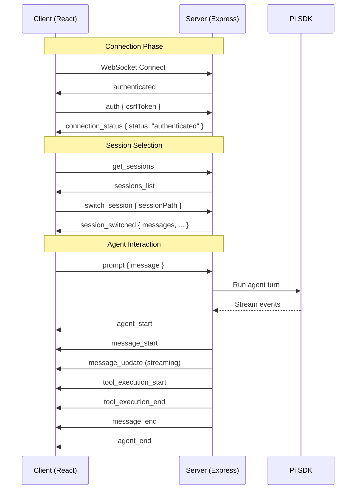
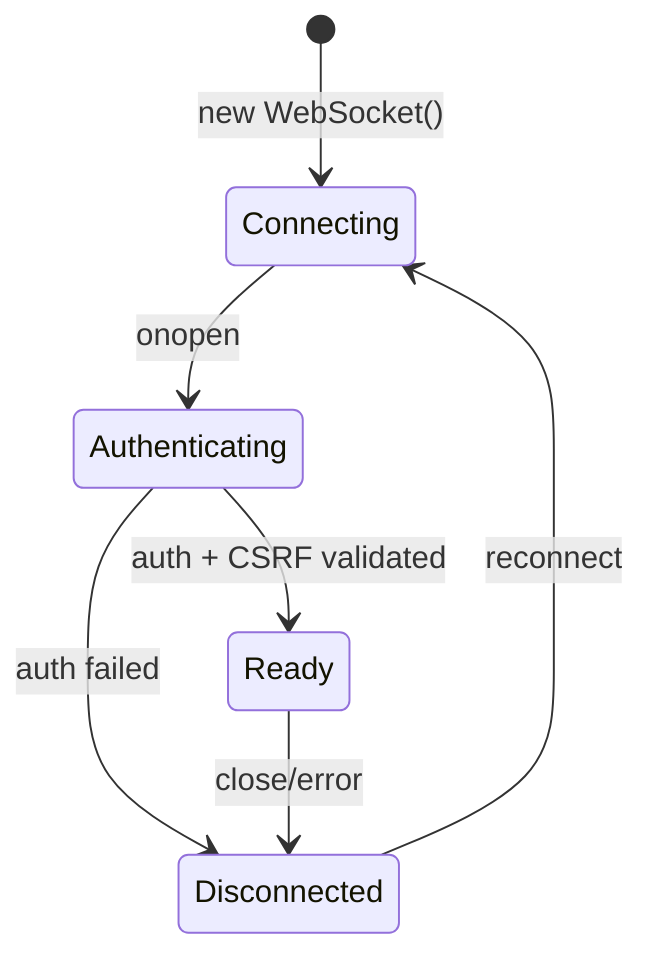
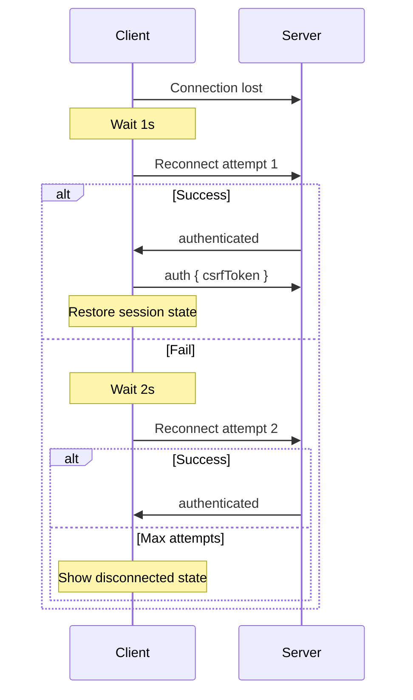
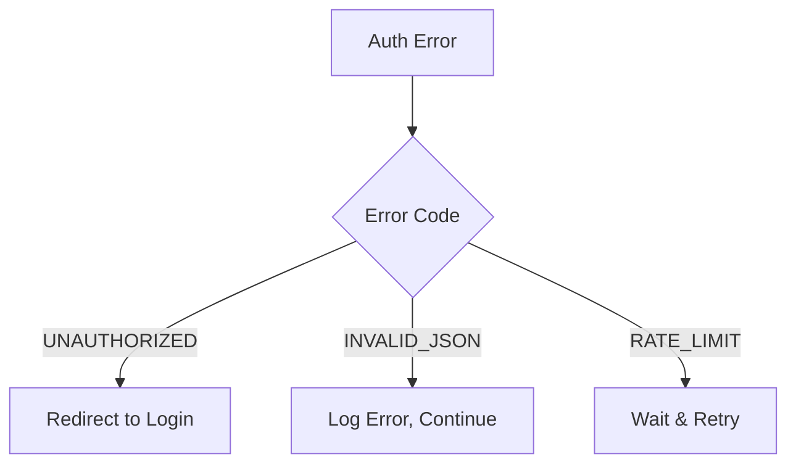
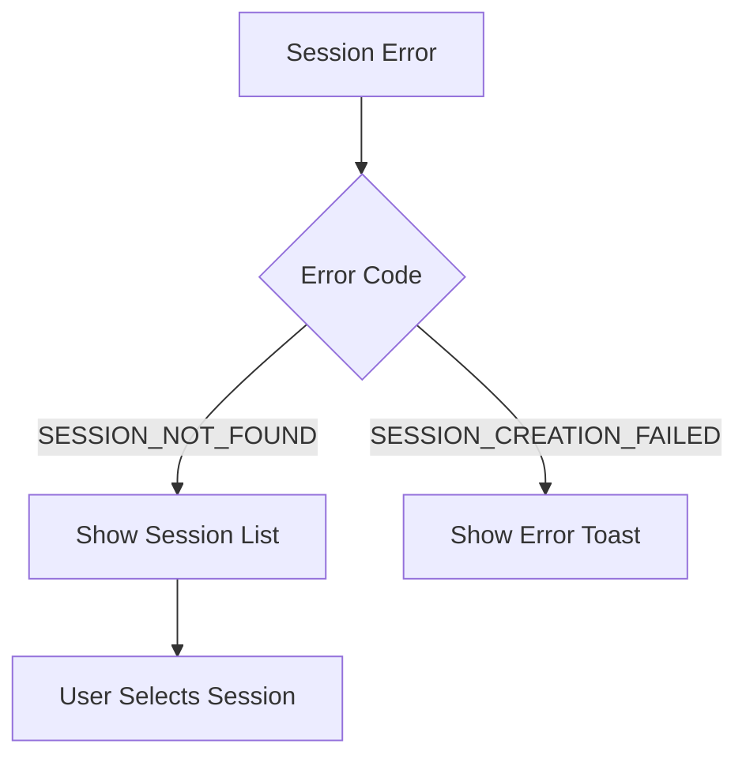
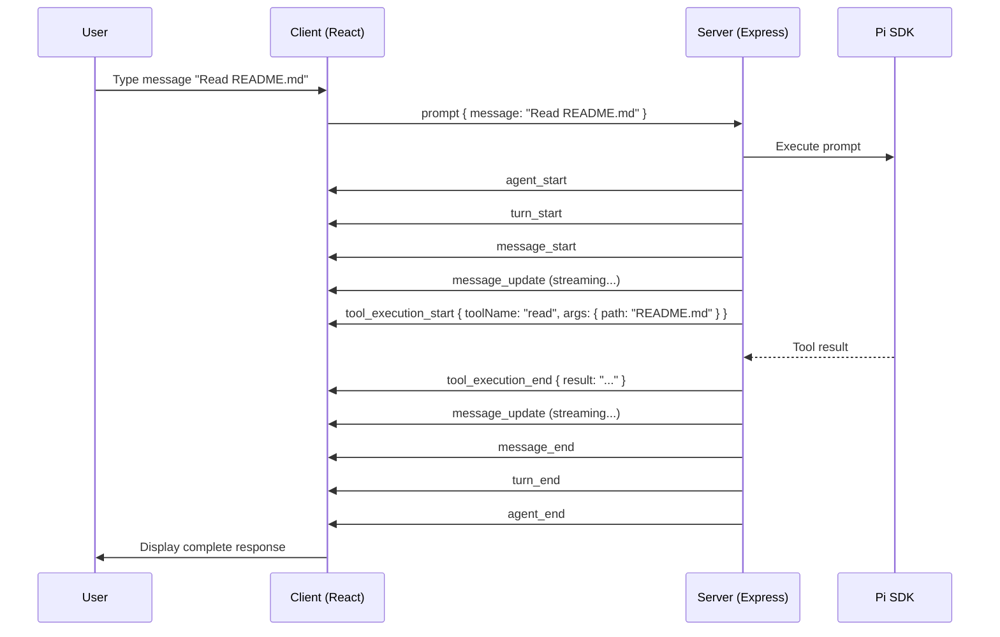
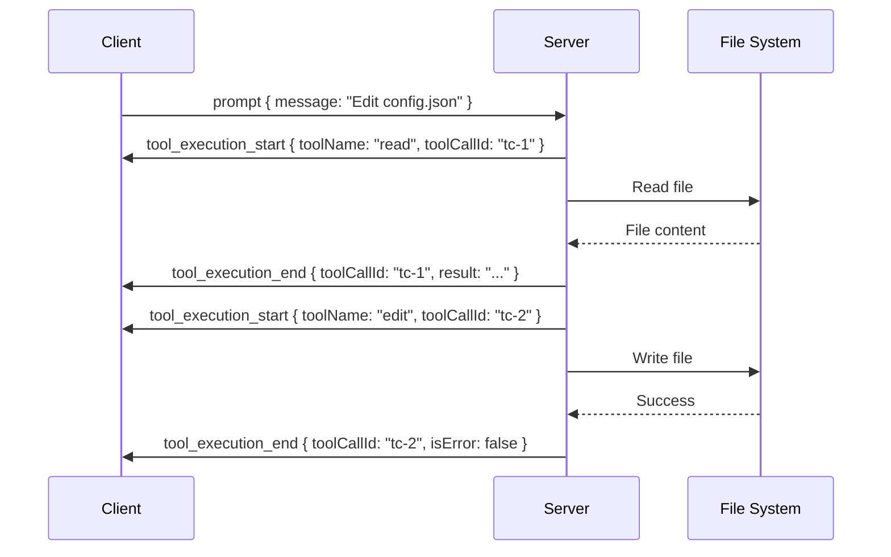
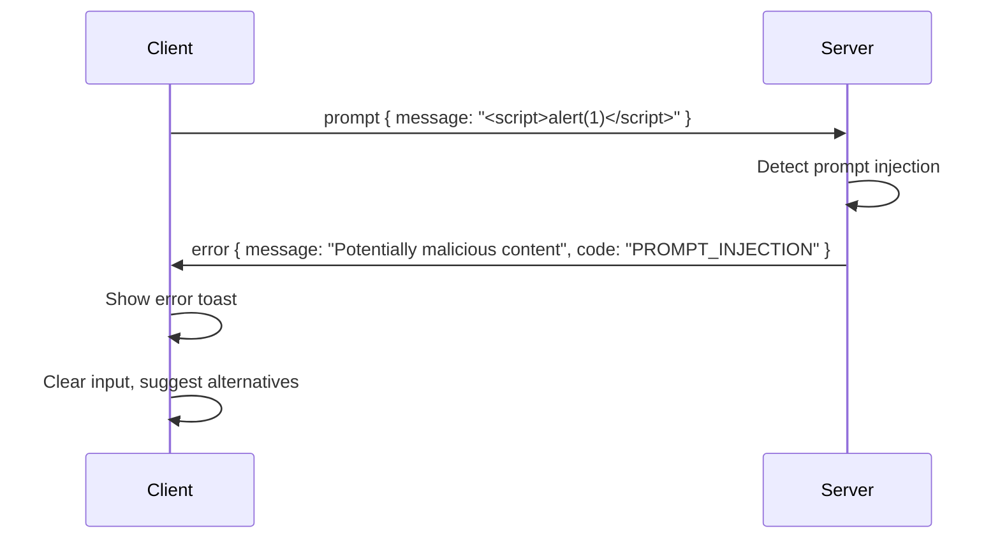
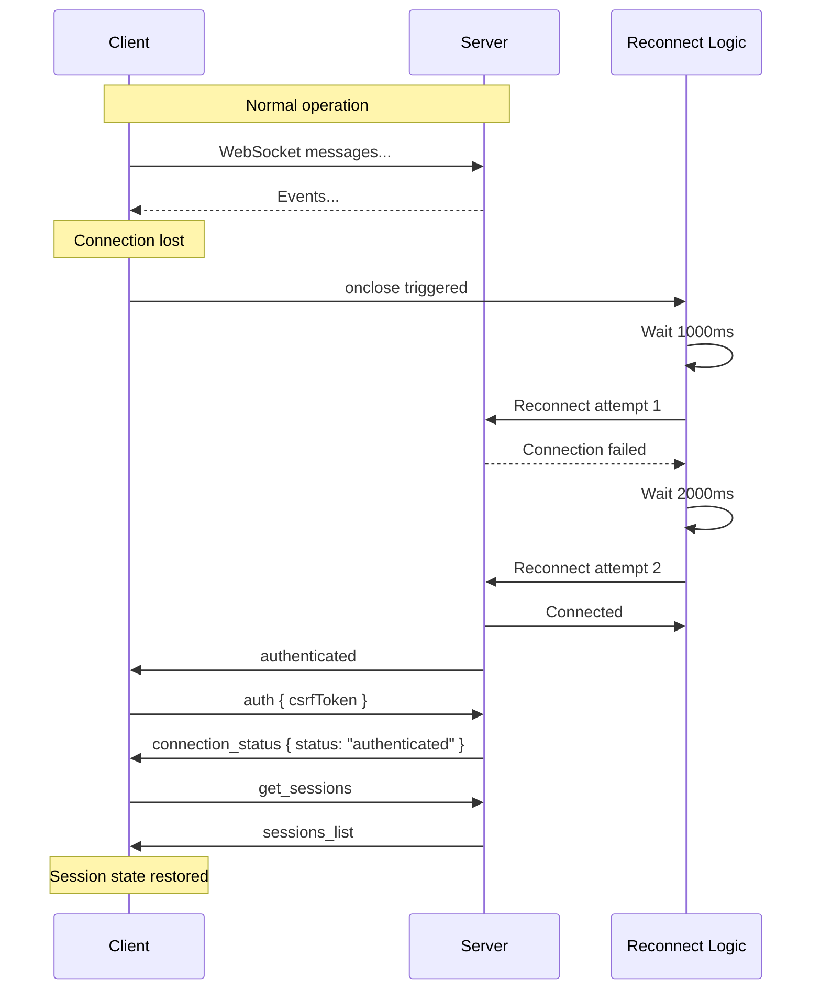
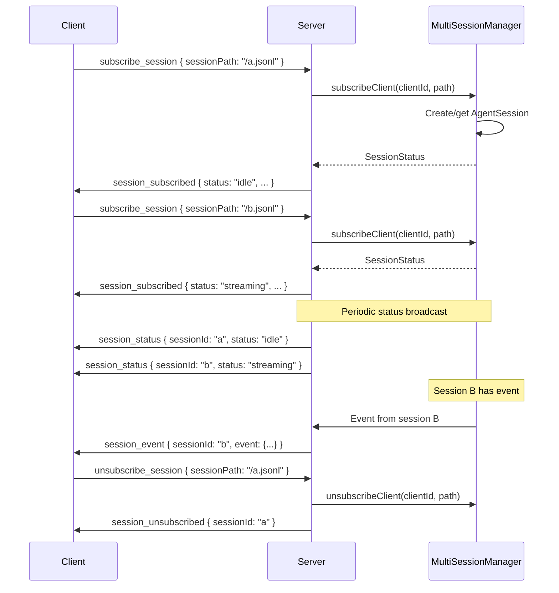

# Pi Web UI Protocol Documentation

> JSON-RPC 2.0 WebSocket API for the Pi Coding Agent Web Interface

## Table of Contents

1. [Overview](#overview)
2. [Connection Lifecycle](#connection-lifecycle)
3. [Client → Server Methods](#client--server-methods)
   - [auth](#auth)
   - [prompt](#prompt)
   - [steer](#steer)
   - [abort](#abort)
   - [new_session](#new_session)
   - [switch_session](#switch_session)
   - [get_sessions](#get_sessions)
   - [get_session_tree](#get_session_tree)
   - [get_session_info](#get_session_info)
   - [fork](#fork)
   - [navigate_tree](#navigate_tree)
   - [set_model](#set_model)
   - [set_thinking_level](#set_thinking_level)
   - [compact](#compact)
   - [extension_ui_response](#extension_ui_response)
   - [set_session_name](#set_session_name)
   - [subscribe_session](#subscribe_session)
   - [unsubscribe_session](#unsubscribe_session)
4. [Server → Client Events](#server--client-events)
   - [Connection Events](#connection-events)
   - [Session Events](#session-events)
   - [Agent Events](#agent-events)
   - [Tool Events](#tool-events)
   - [Extension Events](#extension-events)
5. [Error Handling](#error-handling)
6. [Examples](#examples)

---

## Overview

### JSON-RPC 2.0 Protocol Basics

The Pi Web UI uses a simplified JSON-RPC 2.0-style protocol for bidirectional communication between the React frontend and Express backend via WebSocket.

**Key Characteristics:**
- Messages are JSON objects with a `type` field identifying the message type
- Request/response pattern for methods requiring confirmation
- Fire-and-forget pattern for events/notifications
- All communication happens over a single WebSocket connection

**Base URL:** `ws://localhost:3000/ws` (development) or `wss://your-domain.com/ws` (production)

### Protocol Type Definitions

```typescript
/** Base client message structure */
interface ClientMessage {
  type: string;
  [key: string]: unknown;
}

/** Base server message structure */
interface ServerMessage {
  type: string;
  [key: string]: unknown;
}

/** Image content for multimodal messages */
interface ImageContent {
  type: 'image';
  data: string;      // base64 encoded
  mimeType: string;  // e.g., 'image/png'
}
```

### Message Flow Diagram



---

## Connection Lifecycle

### Connect → Initialize → Ready



#### Step 1: WebSocket Connection

```typescript
// Client initiates WebSocket connection
const ws = new WebSocket('ws://localhost:3000/ws');
```

#### Step 2: Server Authentication

Upon connection, the server validates the JWT cookie and sends initial confirmation:

```json
{ "type": "authenticated", "sessionId": "client_1234567890_abc123" }
```

#### Step 3: CSRF Token Validation

The client must send a CSRF token to complete authentication:

```json
{ "type": "auth", "csrfToken": "csrf_token_from_login" }
```

Server responds:

```json
{ "type": "connection_status", "status": "authenticated" }
```

### History Replay on Connect

When switching to a session, the server automatically sends message history:

```typescript
interface SessionSwitched {
  type: 'session_switched';
  sessionId: string;
  sessionPath: string;
  model?: string;           // e.g., "anthropic/claude-3-sonnet"
  contextWindow?: number;   // Total context capacity in tokens
  contextUsed?: number;     // Current usage in tokens
  contextPercent?: number;  // Usage as percentage
  messages: SessionMessage[];
  fileTimestamp: number;    // For cache invalidation
  isStreaming: boolean;     // Whether session is currently active
}

interface SessionMessage {
  id: string;
  role: 'user' | 'assistant';
  content: string | ContentPart[];
  timestamp: number;
}

type ContentPart =
  | { type: 'text'; text: string }
  | { type: 'thinking'; thinking: string };
```

### Graceful Disconnect

```typescript
// Client initiates disconnect
ws.close();

// Server cleans up:
// 1. Unsubscribes client from all sessions
// 2. Cleans up client tracking data
// 3. Does NOT dispose active sessions (they remain for other clients)
```

### Reconnection Handling

The client implements exponential backoff reconnection:

```typescript
interface ReconnectionConfig {
  maxReconnectAttempts: 5;
  baseReconnectDelay: 1000;  // ms
  reconnectDelayMultiplier: 2;
}

// Reconnect delays: 1s, 2s, 4s, 8s, 16s
```

**Reconnection Flow:**



---

## Client → Server Methods

### auth

Validate CSRF token after initial connection.

**Request:**
```typescript
interface AuthRequest {
  type: 'auth';
  csrfToken: string;
}
```

**Example:**
```json
{ "type": "auth", "csrfToken": "x-csrf-token-abc123" }
```

**Success Response:**
```json
{ "type": "connection_status", "status": "authenticated" }
```

**Error Response:**
```json
{ "type": "error", "message": "Invalid CSRF token", "code": "UNAUTHORIZED" }
```

---

### prompt

Send a user message to the agent and start a turn.

**Request:**
```typescript
interface PromptRequest {
  type: 'prompt';
  sessionId: string;
  message: string;
  images?: ImageContent[];
}
```

**Example:**
```json
{
  "type": "prompt",
  "sessionId": "session-123",
  "message": "Read the README.md file and summarize it",
  "images": [
    {
      "type": "image",
      "data": "base64encodedimagedata...",
      "mimeType": "image/png"
    }
  ]
}
```

**Response:**
The server streams agent events (see [Agent Events](#agent-events)). No direct response is sent for successful prompts.

**Error Codes:**
- `SESSION_NOT_FOUND` - No active session
- `PROMPT_INJECTION` - Potentially malicious content detected
- `RATE_LIMIT` - Too many requests

---

### steer

Inject a follow-up message into the currently running agent turn. Unlike `prompt`, this doesn't start a new turn but appends to the current one.

**Request:**
```typescript
interface SteerRequest {
  type: 'steer';
  message: string;
}
```

**Example:**
```json
{ "type": "steer", "message": "Use TypeScript instead of JavaScript" }
```

**Use Case:**
- Guide the agent mid-execution
- Provide clarification during long-running tasks
- Redirect the agent's approach

**Note:** Returns `SESSION_NOT_FOUND` error if no turn is in progress.

---

### abort

Cancel the currently running agent turn or tool execution.

**Request:**
```typescript
interface AbortRequest {
  type: 'abort';
}
```

**Example:**
```json
{ "type": "abort" }
```

**Behavior:**
- Stops current tool execution
- Prevents further tool calls in current turn
- Agent will complete its current thought before stopping

---

### new_session

Create a new agent session.

**Request:**
```typescript
interface NewSessionRequest {
  type: 'new_session';
  cwd?: string;  // Working directory for the session
}
```

**Example:**
```json
{ "type": "new_session", "cwd": "/home/user/projects/myapp" }
```

**Success Response:**
```json
{
  "type": "session_created",
  "sessionId": "session-abc123",
  "sessionPath": "/home/user/.pi/agent/sessions/--home--user--projects--myapp/session-abc123.jsonl"
}
```

---

### switch_session

Switch to an existing session and load its history.

**Request:**
```typescript
interface SwitchSessionRequest {
  type: 'switch_session';
  sessionPath: string;
}
```

**Example:**
```json
{
  "type": "switch_session",
  "sessionPath": "/home/user/.pi/agent/sessions/--home--user--projects--myapp/session-abc123.jsonl"
}
```

**Success Response:**
```json
{
  "type": "session_switched",
  "sessionId": "session-abc123",
  "sessionPath": "/home/user/.pi/agent/sessions/...",
  "model": "anthropic/claude-3-sonnet",
  "contextWindow": 200000,
  "contextUsed": 15000,
  "contextPercent": 7.5,
  "messages": [
    {
      "id": "msg-1",
      "role": "user",
      "content": "Hello",
      "timestamp": 1710000000000
    }
  ],
  "fileTimestamp": 1710000000000,
  "isStreaming": false
}
```

---

### get_sessions

List all available sessions.

**Request:**
```typescript
interface GetSessionsRequest {
  type: 'get_sessions';
  cwd?: string;  // Filter by working directory
}
```

**Example:**
```json
{ "type": "get_sessions", "cwd": "/home/user/projects" }
```

**Success Response:**
```json
{
  "type": "sessions_list",
  "sessions": [
    {
      "id": "session-abc123",
      "path": "/home/user/.pi/agent/sessions/.../session.jsonl",
      "firstMessage": "Read the README and summarize",
      "messageCount": 15,
      "cwd": "/home/user/projects/myapp",
      "name": "My App Session",
      "createdAt": "2024-03-10T10:00:00.000Z",
      "lastActivity": "2024-03-10T11:30:00.000Z"
    }
  ]
}
```

---

### get_session_tree

Get the navigation tree for session history (branching support).

**Request:**
```typescript
interface GetSessionTreeRequest {
  type: 'get_session_tree';
  sessionId: string;
}
```

**Success Response:**
```json
{
  "type": "session_tree",
  "tree": []
}
```

> **Note:** Tree navigation is not yet fully implemented.

---

### get_session_info

Get detailed statistics about the current session.

**Request:**
```typescript
interface GetSessionInfoRequest {
  type: 'get_session_info';
}
```

**Success Response:**
```json
{
  "type": "session_info",
  "stats": {
    "sessionFile": "/path/to/session.jsonl",
    "sessionId": "session-abc123",
    "cwd": "/home/user/projects/myapp",
    "userMessages": 10,
    "assistantMessages": 10,
    "toolCalls": 25,
    "toolResults": 25,
    "totalMessages": 70,
    "tokens": {
      "input": 50000,
      "output": 12000,
      "cacheRead": 30000,
      "cacheWrite": 5000,
      "total": 97000
    },
    "cost": 0.45,
    "model": "anthropic/claude-3-sonnet",
    "contextWindow": 200000,
    "contextUsed": 97000,
    "contextPercent": 48.5
  }
}
```

---

### fork

Create a branch from a specific point in session history.

**Request:**
```typescript
interface ForkRequest {
  type: 'fork';
  entryId: string;
}
```

> **Note:** Forking is not yet fully implemented.

---

### navigate_tree

Navigate to a different point in session history.

**Request:**
```typescript
interface NavigateTreeRequest {
  type: 'navigate_tree';
  entryId: string;
  summarize?: boolean;
}
```

> **Note:** Tree navigation is not yet fully implemented.

---

### set_model

Change the model for the current session.

**Request:**
```typescript
interface SetModelRequest {
  type: 'set_model';
  modelId: string;  // Format: "provider/model-name"
}
```

**Example:**
```json
{ "type": "set_model", "modelId": "anthropic/claude-3-sonnet" }
```

**Success Response:**
```json
{ "type": "model_changed", "modelId": "anthropic/claude-3-sonnet" }
```

**Supported Providers:**
- `anthropic/` - Claude models
- `openai/` - GPT models
- `google/` - Gemini models
- `openrouter/` - OpenRouter models

---

### set_thinking_level

Configure the thinking/reasoning depth for the model.

**Request:**
```typescript
interface SetThinkingLevelRequest {
  type: 'set_thinking_level';
  level: 'off' | 'minimal' | 'low' | 'medium' | 'high' | 'xhigh';
}
```

**Example:**
```json
{ "type": "set_thinking_level", "level": "high" }
```

**Success Response:**
```json
{ "type": "thinking_level_changed", "level": "high" }
```

---

### compact

Trigger context compaction to reduce token usage.

**Request:**
```typescript
interface CompactRequest {
  type: 'compact';
  customInstructions?: string;
}
```

**Example:**
```json
{
  "type": "compact",
  "customInstructions": "Focus on the database schema changes"
}
```

**Success Response:**
```json
{
  "type": "compaction_result",
  "summary": "Compacted session from 150000 to 45000 tokens",
  "tokensBefore": 150000,
  "contextWindow": 200000,
  "contextUsed": 45000,
  "contextPercent": 22.5
}
```

---

### extension_ui_response

Respond to an extension UI request (confirmation dialogs, inputs, etc.).

**Request:**
```typescript
interface ExtensionUIResponse {
  type: 'extension_ui_response';
  response: {
    id: string;
    approved?: boolean;
    value?: unknown;
    cancelled?: boolean;
  };
}
```

**Example:**
```json
{
  "type": "extension_ui_response",
  "response": {
    "id": "confirm-123",
    "approved": true
  }
}
```

---

### set_session_name

Rename a session.

**Request:**
```typescript
interface SetSessionNameRequest {
  type: 'set_session_name';
  sessionId: string;
  name: string;
}
```

**Example:**
```json
{
  "type": "set_session_name",
  "sessionId": "session-abc123",
  "name": "Database Migration Work"
}
```

**Success Response:**
```json
{
  "type": "session_name_changed",
  "sessionId": "session-abc123",
  "name": "Database Migration Work"
}
```

---

### subscribe_session

Subscribe to receive real-time events for a specific session (multi-session support).

**Request:**
```typescript
interface SubscribeSessionRequest {
  type: 'subscribe_session';
  sessionPath: string;
}
```

**Example:**
```json
{
  "type": "subscribe_session",
  "sessionPath": "/home/user/.pi/agent/sessions/.../session.jsonl"
}
```

**Success Response:**
```typescript
interface SessionSubscribed {
  type: 'session_subscribed';
  sessionId: string;
  sessionPath: string;
  status: SessionStatus;
  messageCount?: number;
  currentStep?: number;
}

type SessionStatus = 'idle' | 'busy' | 'streaming' | 'error';
```

**Example:**
```json
{
  "type": "session_subscribed",
  "sessionId": "session-abc123",
  "sessionPath": "/home/user/.pi/agent/sessions/.../session.jsonl",
  "status": "idle",
  "messageCount": 15,
  "currentStep": 0
}
```

---

### unsubscribe_session

Unsubscribe from a session's events.

**Request:**
```typescript
interface UnsubscribeSessionRequest {
  type: 'unsubscribe_session';
  sessionPath: string;
}
```

**Success Response:**
```typescript
interface SessionUnsubscribed {
  type: 'session_unsubscribed';
  sessionId: string;
  sessionPath?: string;
}
```

---

## Server → Client Events

### Connection Events

#### authenticated

Sent immediately after WebSocket connection is established.

```typescript
interface AuthenticatedEvent {
  type: 'authenticated';
  sessionId: string;  // Client ID for this connection
}
```

#### connection_status

Sent after CSRF token validation.

```typescript
interface ConnectionStatusEvent {
  type: 'connection_status';
  status: 'authenticated' | 'disconnected';
}
```

#### error

General error message.

```typescript
interface ErrorEvent {
  type: 'error';
  message: string;
  code?: string;
}
```

---

### Session Events

#### sessions_list

Response to `get_sessions` request.

```typescript
interface SessionsListEvent {
  type: 'sessions_list';
  sessions: SessionInfo[];
}

interface SessionInfo {
  id: string;
  path: string;
  firstMessage: string;
  messageCount: number;
  cwd: string;
  name?: string;
  createdAt?: string;
  lastActivity?: string;
}
```

#### session_created

Confirmation of new session creation.

```typescript
interface SessionCreatedEvent {
  type: 'session_created';
  sessionId: string;
  sessionPath: string;
}
```

#### session_switched

Confirmation of session switch with full history.

```typescript
interface SessionSwitchedEvent {
  type: 'session_switched';
  sessionId: string;
  sessionPath: string;
  model?: string;
  contextWindow?: number;
  contextUsed?: number;
  contextPercent?: number;
  messages: SessionMessage[];
  fileTimestamp: number;
  isStreaming: boolean;
}
```

#### session_update

Real-time notification of session file changes (from CLI or other clients).

```typescript
interface SessionUpdateEvent {
  type: 'session_update';
  changeType: 'add' | 'change' | 'unlink';
  path: string;
  sessionId?: string;
  cwd?: string;
  info?: SessionInfo;
}
```

#### session_name_updated / session_name_changed

Broadcast when a session is renamed.

```typescript
interface SessionNameEvent {
  type: 'session_name_updated' | 'session_name_changed';
  sessionId: string;
  name: string;
}
```

#### session_status

Periodic broadcast of all session statuses (every 1 second).

```typescript
interface SessionStatusBroadcast {
  type: 'session_status';
  sessionId: string;
  sessionPath: string;
  status: 'idle' | 'busy' | 'streaming' | 'error';
  lastActivity: string;  // ISO timestamp
  messageCount: number;
  currentStep?: number;
}
```

#### session_event

Wrapped agent event with session routing (multi-session support).

```typescript
interface SessionEventEnvelope {
  type: 'session_event';
  sessionId: string;
  event: ForwardedEvent;
}
```

---

### Agent Events

These events are forwarded from the Pi SDK during agent execution.

#### agent_start

Agent begins processing.

```typescript
interface AgentStartEvent {
  type: 'agent_start';
  timestamp: number;
}
```

#### agent_end

Agent completes all processing.

```typescript
interface AgentEndEvent {
  type: 'agent_end';
  timestamp: number;
  messages: unknown[];
}
```

#### turn_start

A new turn begins.

```typescript
interface TurnStartEvent {
  type: 'turn_start';
  timestamp: number;
}
```

#### turn_end

Turn completes.

```typescript
interface TurnEndEvent {
  type: 'turn_end';
  timestamp: number;
  message: unknown;
  toolResults: unknown[];
}
```

#### message_start

Assistant begins streaming a message.

```typescript
interface MessageStartEvent {
  type: 'message_start';
  timestamp: number;
  message: {
    id: string;
    role: 'assistant';
    content: ContentPart[];
  };
}
```

#### message_update

Streaming content update.

```typescript
interface MessageUpdateEvent {
  type: 'message_update';
  timestamp: number;
  message: { id: string };
  assistantMessageEvent: {
    type: 'content_block_delta';
    delta: { type: 'text_delta' | 'thinking_delta'; text?: string; thinking?: string };
  };
}
```

#### message_end

Message streaming complete.

```typescript
interface MessageEndEvent {
  type: 'message_end';
  timestamp: number;
  message: { id: string | null };
}
```

#### auto_compaction_start

Automatic context compaction triggered.

```typescript
interface AutoCompactionStartEvent {
  type: 'auto_compaction_start';
  timestamp: number;
  reason: string;
}
```

#### auto_compaction_end

Context compaction completed.

```typescript
interface AutoCompactionEndEvent {
  type: 'auto_compaction_end';
  timestamp: number;
  result: unknown;
  aborted: boolean;
  willRetry: boolean;
  errorMessage?: string;
}
```

#### auto_retry_start

Automatic retry initiated (after API error).

```typescript
interface AutoRetryStartEvent {
  type: 'auto_retry_start';
  timestamp: number;
  attempt: number;
  maxAttempts: number;
  delayMs: number;
  errorMessage: string;
}
```

#### auto_retry_end

Retry completed.

```typescript
interface AutoRetryEndEvent {
  type: 'auto_retry_end';
  timestamp: number;
  success: boolean;
  attempt: number;
  finalError?: string;
}
```

---

### Tool Events

#### tool_execution_start

Tool begins execution.

```typescript
interface ToolExecutionStartEvent {
  type: 'tool_execution_start';
  timestamp: number;
  toolCallId: string;
  toolName: string;
  args: unknown;
}
```

#### tool_execution_update

Partial result during tool execution.

```typescript
interface ToolExecutionUpdateEvent {
  type: 'tool_execution_update';
  timestamp: number;
  toolCallId: string;
  toolName: string;
  args: unknown;
  partialResult: unknown;
}
```

#### tool_execution_end

Tool execution complete.

```typescript
interface ToolExecutionEndEvent {
  type: 'tool_execution_end';
  timestamp: number;
  toolCallId: string;
  toolName: string;
  result: unknown;
  isError: boolean;
}
```

---

### Extension Events

#### extension_ui_request

Extension requests user interaction.

```typescript
interface ExtensionUIRequestEvent {
  type: 'extension_ui_request';
  request: {
    id: string;
    type: 'confirm' | 'select' | 'input' | 'editor';
    method: string;
    params: Record<string, unknown>;
    timeout: number;
  };
}
```

#### extension_error

Extension encountered an error.

```typescript
interface ExtensionErrorEvent {
  type: 'extension_error';
  extensionPath: string;
  event: string;
  error: string;
}
```

---

## Error Handling

### Standard Error Codes

The protocol uses string-based error codes for clarity:

| Code | Description | HTTP Equivalent |
|------|-------------|-----------------|
| `UNAUTHORIZED` | Not authenticated or invalid credentials | 401 |
| `SESSION_NOT_FOUND` | Requested session doesn't exist | 404 |
| `SESSION_CREATION_FAILED` | Failed to create new session | 500 |
| `SUBSCRIBE_FAILED` | Failed to subscribe to session | 500 |
| `NOT_IMPLEMENTED` | Feature not yet implemented | 501 |
| `INVALID_MESSAGE` | Malformed or invalid message | 400 |
| `INVALID_JSON` | JSON parsing failed | 400 |
| `RATE_LIMIT` | Too many requests | 429 |
| `PROMPT_INJECTION` | Potentially malicious input detected | 400 |
| `INTERNAL_ERROR` | Server-side error | 500 |
| `MODEL_CHANGE_FAILED` | Failed to change model | 500 |

### Error Response Format

```typescript
interface ErrorResponse {
  type: 'error';
  message: string;
  code?: string;
}
```

**Example:**
```json
{
  "type": "error",
  "message": "Session not found: session-xyz",
  "code": "SESSION_NOT_FOUND"
}
```

### Error Recovery Strategies

#### Authentication Errors



#### Session Errors



#### Streaming Errors

When errors occur during streaming:

1. `agent_end` event is sent with error info
2. Client should clear streaming state
3. User should be notified with actionable message

---

## Examples

### Full Conversation Flow



### Tool Execution Sequence



### Error Handling Example



### Reconnection Scenario



### Multi-Session Subscription Flow



---

## Appendix: Complete Type Definitions

```typescript
// ============================================================================
// Client → Server Messages
// ============================================================================

type ClientMessage =
  | { type: 'auth'; csrfToken: string }
  | { type: 'prompt'; sessionId: string; message: string; images?: ImageContent[] }
  | { type: 'steer'; message: string }
  | { type: 'follow_up'; message: string }
  | { type: 'abort' }
  | { type: 'new_session'; cwd?: string }
  | { type: 'switch_session'; sessionPath: string }
  | { type: 'get_sessions'; cwd?: string }
  | { type: 'get_session_tree'; sessionId: string }
  | { type: 'get_session_info' }
  | { type: 'fork'; entryId: string }
  | { type: 'navigate_tree'; entryId: string; summarize?: boolean }
  | { type: 'set_model'; modelId: string }
  | { type: 'set_thinking_level'; level: 'off' | 'minimal' | 'low' | 'medium' | 'high' | 'xhigh' }
  | { type: 'compact'; customInstructions?: string }
  | { type: 'extension_ui_response'; response: ExtensionUIResponse }
  | { type: 'set_session_name'; sessionId: string; name: string }
  | { type: 'subscribe_session'; sessionPath: string }
  | { type: 'unsubscribe_session'; sessionPath: string };

// ============================================================================
// Server → Client Messages
// ============================================================================

type ServerMessage =
  // Connection
  | { type: 'authenticated'; sessionId: string }
  | { type: 'connection_status'; status: string }
  | { type: 'error'; message: string; code?: string }
  // Sessions
  | { type: 'sessions_list'; sessions: SessionInfo[] }
  | { type: 'session_created'; sessionId: string; sessionPath: string }
  | { type: 'session_switched'; sessionId: string; sessionPath: string; model?: string; contextWindow?: number; contextUsed?: number; contextPercent?: number; messages: SessionMessage[]; fileTimestamp: number; isStreaming: boolean }
  | { type: 'session_tree'; tree: TreeNode[] }
  | { type: 'session_info'; stats: SessionStats }
  | { type: 'session_update'; changeType: 'add' | 'change' | 'unlink'; path: string; sessionId?: string; cwd?: string; info?: SessionInfo }
  | { type: 'session_name_updated'; sessionId: string; name: string }
  | { type: 'session_name_changed'; sessionId: string; name: string }
  | { type: 'session_status'; sessionId: string; sessionPath: string; status: SessionStatus; lastActivity: string; messageCount: number; currentStep?: number }
  | { type: 'session_event'; sessionId: string; event: ForwardedEvent }
  | { type: 'session_subscribed'; sessionId: string; sessionPath: string; status: SessionStatus; messageCount?: number; currentStep?: number }
  | { type: 'session_unsubscribed'; sessionId: string; sessionPath?: string }
  // Model/Config
  | { type: 'model_changed'; modelId: string }
  | { type: 'thinking_level_changed'; level: string }
  | { type: 'compaction_result'; summary: string; tokensBefore: number; contextWindow?: number; contextUsed?: number; contextPercent?: number }
  // Agent Events
  | { type: 'agent_start' }
  | { type: 'agent_end'; messages: unknown[] }
  | { type: 'turn_start' }
  | { type: 'turn_end'; message: unknown; toolResults: unknown[] }
  | { type: 'message_start'; message: unknown }
  | { type: 'message_update'; message: unknown; assistantMessageEvent: unknown }
  | { type: 'message_end'; message: unknown }
  | { type: 'auto_compaction_start'; reason: string }
  | { type: 'auto_compaction_end'; result: unknown; aborted: boolean; willRetry: boolean }
  | { type: 'auto_retry_start'; attempt: number; maxAttempts: number; delayMs: number; errorMessage: string }
  | { type: 'auto_retry_end'; success: boolean; attempt: number; finalError?: string }
  // Tool Events
  | { type: 'tool_execution_start'; toolCallId: string; toolName: string; args: unknown }
  | { type: 'tool_execution_update'; toolCallId: string; toolName: string; args: unknown; partialResult: unknown }
  | { type: 'tool_execution_end'; toolCallId: string; toolName: string; result: unknown; isError: boolean }
  // Extension Events
  | { type: 'extension_error'; extensionPath: string; event: string; error: string }
  | { type: 'extension_ui_request'; request: ExtensionUIRequest };

// ============================================================================
// Shared Types
// ============================================================================

interface ImageContent {
  type: 'image';
  data: string;
  mimeType: string;
}

type SessionStatus = 'idle' | 'busy' | 'streaming' | 'error';

interface SessionInfo {
  id: string;
  path: string;
  firstMessage: string;
  messageCount: number;
  cwd: string;
  name?: string;
  createdAt?: string;
  lastActivity?: string;
}

interface SessionMessage {
  id: string;
  role: 'user' | 'assistant';
  content: string | ContentPart[];
  timestamp: number;
}

type ContentPart =
  | { type: 'text'; text: string }
  | { type: 'thinking'; thinking: string };

interface SessionStats {
  sessionFile?: string;
  sessionId?: string;
  cwd?: string;
  userMessages?: number;
  assistantMessages?: number;
  toolCalls?: number;
  toolResults?: number;
  totalMessages?: number;
  messageCount?: number;
  tokens?: {
    input: number;
    output: number;
    cacheRead: number;
    cacheWrite: number;
    total: number;
  };
  cost?: number;
  model?: string;
  contextWindow?: number;
  contextUsed?: number;
  contextPercent?: number;
}

interface TreeNode {
  id: string;
  parentId: string | null;
  type: string;
  label?: string;
  children: TreeNode[];
}

interface ExtensionUIResponse {
  id: string;
  approved?: boolean;
  value?: unknown;
  cancelled?: boolean;
}

interface ExtensionUIRequest {
  id: string;
  type: 'confirm' | 'select' | 'input' | 'editor';
  method: string;
  params: Record<string, unknown>;
  timeout: number;
}

interface ForwardedEvent {
  type: string;
  timestamp: number;
  [key: string]: unknown;
}
```

---

## Version History

| Version | Date | Changes |
|---------|------|---------|
| 1.0.0 | 2024-03-26 | Initial protocol documentation |

---

## See Also

- [API.md](../API.md) - REST API documentation
- [SECURITY.md](../SECURITY.md) - Authentication and security architecture
- [AGENTS.md](../AGENTS.md) - Developer guide for the codebase
