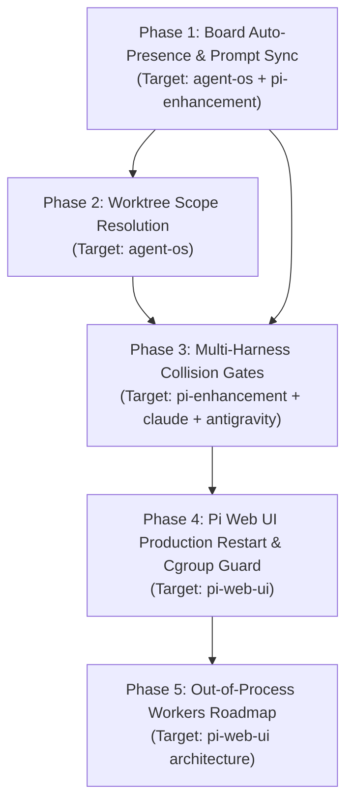

# Unified Implementation Plan: Multi-Agent Coordination, Harness-Enforced Safety Gates, and Pi Web UI Internal API Robustness

**Document ID:** `PLAN-COORDINATION-ROBUSTNESS-2026-09-15`  
**Date:** 2026-09-15  
**Author:** Antigravity / DeepMind Conductor  
**Status:** DRAFT — Ready for Operator Review & Phased Execution  
**Governing Authority:** `INTENT.md`, `/root/agent-os/docs/CURRENT-STATE.md`, and `/root/.gemini/AGENTS.md` (Global Instructions)

---

## 1. Intent, Rationale & Operational Context

### 1.1 Intent
To eliminate cross-agent collisions, zombie presence states, and control-plane crashes across multi-agent sessions on this host. This plan ensures that multiple orchestrators can concurrently run 4–5 children each without risking collateral disruption, unexpected cgroup `SIGKILL` cascades, or rogue service restarts.

### 1.2 Governing Rationale: The Failure of "Model Discipline"
In an agentic OS, coordination cannot rely on **model discipline** (hoping an LLM reads a rule in `AGENTS.md` and voluntarily runs `agent-os board declare` or checks `agent-os board who`). An empirical census of 40 real sessions on this host demonstrated that under high cognitive load:
- **52.5%** of sessions never declare their presence.
- **75.0%** of sessions never inspect the board before mutating files or starting services.
- **25.0%** run uncoordinated `pkill -f` commands that risk terminating sibling agents' processes.
- **10.0%** restart the production service while peer agents are actively running in-flight turns.

Coordination must therefore be **harness-enforced and event-driven**: moved out of the model's conscience and into lifecycle hooks, filesystem probes, and tool pre-flight gates that mechanically prevent collisions before commands are executed.

---

### 1.3 Forensic Evidence & Session Signposts

This plan is directly grounded in empirical forensics collected from live session logs, repository commit histories, and systemd journal events on this host:

#### 1. The 08:30 UTC Cgroup Cascade Crash (2026-09-15)
- **Primary Session:** `/root/.pi/agent/sessions/--root-pi-web-ui--/2026-09-15T07-56-10-243Z_01a0a410-f683-7422-bc57-055af50db3f2.jsonl` (Parent conductor).
- **Recovery Session:** `/root/.pi/agent/sessions/--root-pi-web-ui--/2026-09-15T09-10-31-448Z_01a0a455-0917-7729-9433-fcd8b4d7556d.jsonl` (Adopted parent).
- **Evidence:** At 08:30:22 UTC, parent `01a0a410` was orchestrating four children in isolated worktrees (`wt-handoff`, `wt-pin`, `wt-voice`, `wt-stability`). Concurrently, a validation server was started inside the production service cgroup (`/system.slice/pi-web-ui.service`). When systemd stopped or restarted the unit with `KillMode=control-group`, it issued a blanket kernel `SIGKILL` to the entire cgroup.
- **Casualties:** Production server, validation server, parent `01a0a410`, and all four children were instantly killed mid-turn.
- **Commit Reference:** `/root/pi-web-ui-wt-stability` commit `2823c72` authored `server/src/live-validation/validation-cgroup-guard.ts` and unit test `server/tests/unit/validation-cgroup-guard.test.ts` to refuse starting validation servers inside `/system.slice/pi-web-ui.service`.

#### 2. The 09:05 UTC Disposable Validation Teardown Near-Miss (2026-09-15)
- **Session:** `/root/.pi/agent/sessions/--root-pi-web-ui--/2026-09-15T08-07-19-360Z_01a0a41b-2c3f-71f3-84cd-f0bb83ff651f.jsonl` (Model catalog task).
- **Evidence (Steps 514–519):** Session `01a0a41b` ran validation server `/tmp/pi-v41-live-a`. During teardown, its process check (`ps -eo pid,ppid,pgid,stat,args`) detected:
  ```text
  2222704 2222645 2222579 S sh -c npx tsx scripts/validation-server.ts --dir /tmp/child-voice-srv --port 3491
  ```
  This was child `voice-multilane` (session `01a0a42e`, under adopted parent `01a0a455`) running a concurrent validation server. The teardown wrapper alerted on a transient unverified child. `01a0a41b` verified its own PID (2190459) was dead and emitted the Telegram milestone:
  > *"📍 Milestone: disposable validation teardown reconciled: The validation wrapper reported a transient unverified child at shutdown. I independently checked the recorded PID and process table: the PID is gone, no Pi V4.1 validation process remains, and the disposable directory is absent. Production was untouched."*
- **The Core Risk:** Neither agent knew the other was running a validation server. If either agent had executed `pkill -f validation-server` (as suggested in older runbooks), it would have terminated the other agent's test suite mid-execution.

#### 3. The 2026-09-14 SIGABRT / Watchdog Storm
- **Session:** `/root/.pi/agent/sessions/--root-pi-web-ui--/2026-09-11T19-55-45-981Z_01a0920a-55bc-7367-8281-00dc765d8225.jsonl`.
- **Evidence (Step 3352):** Service restarted repeatedly every ~68 seconds with `Failed with result 'watchdog'` (`SIGABRT`). The agent investigated and confirmed:
  > *"The answer to 'who is restarting it': me. First thing it recorded: pi-web-ui STOP OBSERVED code=dumped signal=ABRT pi-web-ui.service: Failed with result 'watchdog'…"*
- **Commit Reference:** Commit `7e68f79` (`fix(ops): the watchdog worker must not unref its timer`) and commit `81e47cc` (`fix(ops): move the watchdog ping off the event loop, and time every shutdown step`).

#### 4. The 40-Session Census (Summary Table)
Analyzed from `/root/.pi/agent/sessions/--root-pi-web-ui--/*.jsonl` (sorted by mtime, September 11–15, 2026):

| Metric | Measured Count | Percentage | Operational Implication |
|---|---|---|---|
| **Total Analyzed Sessions** | 40 | 100% | High-density real-world multi-agent window |
| **Explicit Board Declare** | 19 / 40 | **47.5%** | 52.5% of sessions never declare their intent |
| **Explicit Board Leave** | 8 / 40 | **20.0%** | 80% abandon board rows to linger until TTL expires |
| **Checked Board (`board who`)** | 10 / 40 | **25.0%** | 75% execute without checking peer state |
| **Spawned Validation Server** | 17 / 40 | **42.5%** | Massive concurrency on ephemeral ports/dirs |
| **Ran `pkill` / `kill -9`** | 10 / 40 | **25.0%** | Severe risk of collateral process slaughter |
| **Restarted Production** | 4 / 40 | **10.0%** | Immediate kill of all concurrent child turns |

#### 5. Architectural Memory & Robustness Citations
- `/root/pi-web-ui-oom-robustness-review-2026-09-05.md`: Documents that ordinary Pi execution is **in-process** (main Node.js heap), session ownership is split between `PiService` and `MultiSessionManager`, and websocket message flooding produced 162 MB of serialized JSON across deltas.
- `/root/pi-web-ui/docs/plans/VOICE-MODE-BROWSER-E2E-RESULTS.md:246` (Commit `5f05e9c`): Previously advised: *"Stop with `pkill -f validation-server`"*, creating the multi-agent hazard that caused the 09:05 near-miss.
- `/root/agent-os/docs/execution/INJECTION-PROGRAMME-PLAN.md`: Establishes D1–D4 injection architecture and fail-open deadlines ($\le 1,500\text{ ms}$).

---

## 2. Canonical Architecture & Resource Map

The implementation connects four active repositories and system configuration directories:

```text
Host Multi-Agent Architecture:
├── Agent OS (/root/agent-os)
│   ├── src/board/auto-presence.ts          <- Auto-presence registration & task intent sanitisation
│   ├── src/inject/inject.ts                <- Core injection verb (`agent-os inject`)
│   ├── src/inject/coordination.ts          <- Hot-lane peer coordination annex generator
│   ├── src/coordination/gate-command.ts    <- Tool command pre-flight evaluator
│   ├── integrations/claude-code/           <- Canonical Claude Code hooks kit
│   │   ├── hooks.json                      <- Hook specifications (SessionStart, PreToolUse, Stop)
│   │   ├── scripts/pre-tool-bash.sh        <- PreToolUse gate interceptor
│   │   └── install.sh                      <- Installer targeting ~/.claude/settings.json
│   └── integrations/antigravity/           <- Canonical Antigravity hooks kit
│       ├── hooks.json                      <- Hook specifications (PreInvocation, PreToolExecution)
│       ├── scripts/pre-tool-bash.sh        <- PreToolExecution gate interceptor
│       └── install.sh                      <- Installer targeting ~/.gemini/config/hooks.json
├── Pi Enhancement (/root/pi-enhancement)
│   ├── agent-os-inject/emitter.ts          <- Pi extension event emitter
│   ├── agent-os-inject/inject-client.ts    <- Subprocess client for `agent-os inject`
│   ├── agent-os-inject/index.ts            <- Lifecycle hook registrations (before_agent_start, tool hooks)
│   └── (symlinked to /root/.pi/agent/extensions/agent-os-inject)
├── Pi Web UI (/root/pi-web-ui)
│   ├── scripts/restart-production.sh       <- Safe restart script with capacity pre-flight
│   ├── scripts/validation-server.ts        <- Ephemeral validation harness
│   ├── server/src/live-validation/         <- Validation cgroup guard (validation-cgroup-guard.ts)
│   └── server/src/internal-api/            <- Unix socket control plane (capacity, admission, watches)
└── Harness System Configuration Targets:
    ├── Pi:          /root/.pi/agent/extensions/agent-os-inject
    ├── Claude Code: /root/.claude/settings.json
    └── Antigravity: /root/.gemini/config/hooks.json
```

---

## 3. Phased Implementation Specification

Every phase is structured with exact code paths, test requirements, quality gates, and non-negotiable victory blockers.

---

### Phase 1: Fix Agent OS Board Auto-Presence & Prompt Synchronization

#### Intent & Rationale
When an agent session boots, the harness immediately triggers `session_start` before any prompt is typed. `ensureAutoPresence` creates a card with `task: "(initial prompt pending)"`. On turn 2, the user submits a prompt, but the extension emitter awaits the precomputed startup packet, skipping `ensureAutoPresence`. As a result, the card remains `(initial prompt pending)` for its entire TTL. This phase guarantees that the very first substantive prompt immediately overwrites the placeholder with a clean, sanitized task description.

#### Implementation Details

1. **`/root/agent-os/src/board/auto-presence.ts`**:
   - In `ensureAutoPresence(storeRoot, opts)`:
     ```ts
     // When an entry exists and currently holds a pending placeholder or hint semantics:
     const isPendingPrompt = existing.task === '(initial prompt pending)' || existing.assignment === '(initial prompt pending)';
     if (task && (isPendingPrompt || existing.semanticsFrom === 'hint')) {
       updated.task = sanitised || task.slice(0, 160);
       updated.assignment = updated.task;
       updated.semanticsUpdatedAt = now.toISOString();
       updated.status = 'working';
       updated.lastSeenAt = now.toISOString();
     }
     ```
   - Ensure `sanitizeTaskIntent(rawPrompt)` properly reduces slash commands (`/goal`, `/plan`), wrapper XML tags (`<USER_REQUEST>`), and filler (`"Can you please..."`) to clean imperative statements under 120 characters.

2. **`/root/pi-enhancement/agent-os-inject/emitter.ts`**:
   - In `onBeforeAgentStart(event: { prompt: string }, ctx)`:
     On turn 1 (`!this.injectedSessionStart`), ensure `event.prompt` is explicitly forwarded to `ensureAutoPresence` or passed to `fetchSessionStart({ ...ctx, prompt: event.prompt })` so that prompt arrival immediately triggers the task update.

3. **`/root/agent-os/src/inject/inject.ts`**:
   - In `runInject(opts)`:
     On `event === 'user_prompt'`, ensure `ensureAutoPresence` receives `opts.task = opts.prompt` and does not suppress errors silently when writing to `boardStoreDir`.

#### TDD Verification Suite (Red-First)
- File: `/root/agent-os/tests/board-auto-presence-prompt-update.test.ts`
  - `test('session_start initializes with pending placeholder')`: Asserts entry created with `task: '(initial prompt pending)'`.
  - `test('subsequent user_prompt updates task and assignment')`: Calls `ensureAutoPresence` with prompt text; asserts `task` is updated, `assignment` is updated, and `semanticsUpdatedAt` is refreshed.
  - `test('sanitizeTaskIntent extracts clean imperative from wrapped prompts')`: Verifies `<USER_REQUEST>Please fix the auth bug</USER_REQUEST>` yields `"Fix the auth bug"`.
- File: `/root/pi-enhancement/tests/agent-os-inject-auto-presence-sync.test.mjs`
  - `test('onBeforeAgentStart propagates prompt text on turn 1')`: Verifies prompt reaches the runner.

#### Quality Gate & Acceptance Criteria (VICTORY GATES)
- [ ] Unit tests pass: `npm --prefix /root/agent-os test tests/board-auto-presence-prompt-update.test.ts`.
- [ ] Unit tests pass: `npm --prefix /root/pi-enhancement test`.
- [ ] **Live Disposable Proof:** Launch a test session in `/tmp/presence-proof-1` without a prompt. Verify `agent-os board who` displays `(initial prompt pending)`. Send prompt `"Refactor websocket connection"`. Run `agent-os board who` and assert the card now displays `"Refactor websocket connection"`.
- [ ] **Early Victory Blocker:** Victory cannot be declared if any live session on the host remains stuck with `(initial prompt pending)` after its first user prompt turn.

---

### Phase 2: Worktree-Aware Canonical Repo Matching in Coordination Annex

#### Intent & Rationale
Agents concurrently working in git worktrees (`/root/pi-web-ui-wt-voice` vs `/root/pi-web-ui-wt-stability`) share the same underlying repository and test against the same shared services. However, [`coordination.ts`](file:///root/agent-os/src/inject/coordination.ts) currently uses string prefix matching (`boundaryPrefix`) to avoid slow `git` CLI calls. Because neither worktree path is a prefix of the other, sibling agents are completely blind to each other. This phase resolves worktree `.git` files in sub-millisecond time without spawning any `git` processes.

#### Implementation Details

1. **`/root/agent-os/src/inject/coordination.ts`**:
   - Implement fast, synchronous worktree resolution:
     ```ts
     export function resolveCanonicalRepoFromWorktree(dirPath: string): string | null {
       try {
         const gitPointer = path.join(dirPath, '.git');
         if (!fs.existsSync(gitPointer)) return null;
         const stat = fs.statSync(gitPointer);
         if (!stat.isFile()) return null; // Standard repo directory
         const content = fs.readFileSync(gitPointer, 'utf8').trim();
         const match = content.match(/^gitdir:\s*(.+)$/m);
         if (!match || !match[1]) return null;
         const gitDir = path.resolve(dirPath, match[1]);
         // Standard worktree gitdir: /path/to/main-repo/.git/worktrees/<name>
         if (gitDir.includes('/.git/worktrees/')) {
           return gitDir.split('/.git/worktrees/')[0];
         }
         return null;
       } catch {
         return null;
       }
     }
     ```
   - In `readCoordinationViewForCwd(cwd, ...)`:
     Include `resolveCanonicalRepoFromWorktree(cwd)` in the target scope.
     Include canonical worktree roots in `declaredPaths(e)`.
   - Update matching logic: If `sessionA.canonicalRepo === sessionB.canonicalRepo`, register the peer as `matchKind: 'direct'`.

#### TDD Verification Suite (Red-First)
- File: `/root/agent-os/tests/inject-coordination-worktree-resolution.test.ts`
  - `test('resolveCanonicalRepoFromWorktree extracts parent repo from .git file')`: Creates synthetic worktree pointer; asserts canonical path returned.
  - `test('peers in different worktrees of same repo match directly')`: Session in `/tmp/repo-wt-1` and Session in `/tmp/repo-wt-2` match as direct peers in `readCoordinationViewForCwd`.
  - `test('latency overhead remains strictly under 1.0ms')`: Benchmarks 1,000 worktree resolutions; asserts p99 duration $<1.0\text{ ms}$.

#### Quality Gate & Acceptance Criteria (VICTORY GATES)
- [ ] Unit tests pass: `npm --prefix /root/agent-os test tests/inject-coordination-worktree-resolution.test.ts`.
- [ ] **Live Disposable Proof:** Run `readCoordinationViewForCwd('/root/pi-web-ui-wt-voice')` while an entry exists on the board for `/root/pi-web-ui-wt-stability`. Assert the stability peer appears in the coordination annex output under `match: "direct"`.
- [ ] **Early Victory Blocker:** Victory cannot be declared if worktree peer discovery requires spawning a `git` subprocess or passing manual `--repo` flags.

---

### Phase 3: Multi-Harness Tool Execution Collision Gates

#### Intent & Rationale
Telling models in system prompts not to restart production or blanket-kill processes fails under pressure. This phase installs mechanical tool interceptors across Pi, Claude Code, and Antigravity that inspect shell commands before execution. If a command attempts a destructive action (restarting `pi-web-ui.service`, running un-scoped validation servers, or executing blanket `pkill -f validation-server`) while peer turns are active, the harness blocks the command cold and returns an explanatory refusal.

#### Implementation Details

1. **The Shared Gate Logic: `/root/agent-os/src/coordination/gate-command.ts`**:
   - Compiles to executable CLI: `agent-os gate-command "<raw-command>"`.
   - Logic:
     - **Rule 1: Production Restart Guard:**
       Matches: `systemctl\s+(restart|stop)\s+pi-web-ui` or `restart-production\.sh`.
       Action: Queries `GET /api/v1/capacity` via `/root/.pi-web-ui/internal-api.sock`.
       If `activeTurns > 0` and `--force` is absent: Exits code 1 with:
       `"BLOCKED: Pi Web UI has X active child turns in progress. Coordinate on the board or supply --force."`
     - **Rule 2: Blanket Pkill Prohibition:**
       Matches: `pkill\s+-f\s+validation-server` or `killall.*validation-server`.
       Action: Exits code 1 with:
       `"BLOCKED: Blanket pkill of validation servers is prohibited. Read your server PID from server-process.json and kill only your owned PID."`
     - **Rule 3: Cgroup Slice Protection:**
       Matches: `(npm run validate:server|scripts/validation-server\.ts)`.
       Action: Reads `/proc/self/cgroup`. If it contains `/system.slice/pi-web-ui.service` and `--override` is absent: Exits code 1 with:
       `"BLOCKED: Validation servers cannot run inside the production systemd slice. Wrap with: systemd-run --scope --collect npm run validate:server."`

2. **Harness Wire-Up Across Runtimes**:
   - **Pi Coding Agent**:
     In `/root/pi-enhancement/agent-os-inject/index.ts`, add `pi.on('before_tool_execution')`:
     ```ts
     pi.on('before_tool_execution', async (event, ctx) => {
       if (event.toolName === 'bash') {
         const check = await runCommandGate(event.params.command);
         if (!check.allowed) {
           return { cancel: true, message: check.refusalMessage };
         }
       }
     });
     ```
   - **Claude Code**:
     Add `PreToolUse` hook to `/root/agent-os/integrations/claude-code/hooks.json`:
     ```json
     {
       "event": "PreToolUse",
       "matcher": "Bash",
       "command": "/root/agent-os/integrations/claude-code/scripts/pre-tool-bash.sh"
     }
     ```
     Script executes `agent-os gate-command "$COMMAND"`. If it exits non-zero, Claude Code aborts tool execution. Run `/root/agent-os/integrations/claude-code/install.sh` to update `/root/.claude/settings.json`.
   - **Antigravity**:
     Add `PreToolExecution` hook to `/root/agent-os/integrations/antigravity/hooks.json`:
     ```json
     {
       "event": "PreToolExecution",
       "command": "/root/agent-os/integrations/antigravity/scripts/pre-tool-bash.sh"
     }
     ```
     Script executes `agent-os gate-command "$COMMAND"`. Run `/root/agent-os/integrations/antigravity/install.sh` to update `/root/.gemini/config/hooks.json`.

#### TDD Verification Suite (Red-First)
- File: `/root/agent-os/tests/coordination-command-gate.test.ts`
  - `test('blocks systemctl restart when capacity reports active turns')`: Mocks Unix socket returning `activeTurns: 3`; asserts command rejected.
  - `test('permits systemctl restart when --force flag present')`: Asserts pass-through with override.
  - `test('unconditionally rejects blanket pkill')`: Asserts rejection.
  - `test('safe commands execute with under 5ms overhead')`: Asserts `ls -la` passes through instantly.

#### Quality Gate & Acceptance Criteria (VICTORY GATES)
- [ ] Hook configurations verified in all three locations:
  - `/root/.pi/agent/extensions/agent-os-inject`
  - `/root/.claude/settings.json`
  - `/root/.gemini/config/hooks.json`
- [ ] **Live Disposable Proof:** In an isolated test turn, attempt to execute `pkill -f validation-server`; verify the harness aborts tool execution and returns the refusal message directly to the model without spawning a shell.
- [ ] **Early Victory Blocker:** Victory cannot be declared if an agent in any harness can run `systemctl restart pi-web-ui` without `--force` while `GET /api/v1/capacity` reports `activeTurns > 0`.

---

### Phase 4: Pi Web UI Production Restart Safety & Validation Isolation

#### Intent & Rationale
Production service restarts must follow strict drainage protocols to prevent severing active client socket connections, and disposable validation servers must be structurally prevented from inheriting the production cgroup slice.

#### Implementation Details

1. **Merge Cgroup Guard from `wt-stability`**:
   - File: `/root/pi-web-ui/server/src/live-validation/validation-cgroup-guard.ts` (Commit `2823c72` in `pi-web-ui-wt-stability`).
   - Wire into line 1 of `/root/pi-web-ui/scripts/validation-server.ts`:
     ```ts
     const cgroupVerdict = checkValidationCgroup({ cgroupPath: readSelfCgroup() });
     if (!cgroupVerdict.allowed) {
       console.error(`Refusing to start validation server: ${cgroupVerdict.message}`);
       process.exit(1);
     }
     ```

2. **Canonical Production Restart Script: `/root/pi-web-ui/scripts/restart-production.sh`**:
   - Implementation:
     ```bash
     #!/usr/bin/env bash
     set -euo pipefail
     FORCE=0
     if [ "${1:-}" = "--force" ]; then FORCE=1; fi

     SOCKET="/root/.pi-web-ui/internal-api.sock"
     TOKEN="$(cat /root/.pi-web-ui/internal-api-token 2>/dev/null || true)"

     if [ "$FORCE" -eq 0 ] && [ -S "$SOCKET" ] && [ -n "$TOKEN" ]; then
       CAPACITY="$(curl -s --unix-socket "$SOCKET" -H "Authorization: Bearer $TOKEN" http://localhost/api/v1/capacity || true)"
       ACTIVE="$(echo "$CAPACITY" | jq -r '.activeTurns // 0' 2>/dev/null || echo 0)"
       if [ "$ACTIVE" -gt 0 ]; then
         echo "ERROR: Refusing production restart: $ACTIVE active child turns in progress." >&2
         echo "Run with --force to override, or wait for children to settle." >&2
         exit 1
       fi
     fi

     echo "Initiating production restart of pi-web-ui.service..."
     /root/pi-web-ui/scripts/notify.sh milestone "Production restart initiated" "pi-web-ui.service restarting cleanly (active turns: 0)" || true
     systemctl restart pi-web-ui.service
     echo "Production restart complete."
     ```

3. **Validation Server Process Teardown**:
   - In `scripts/validation-server.ts`: Ensure teardown kills only `process.pid` and its direct process group (`kill -- -<pgid>`), never grepping the global process table.

#### TDD Verification Suite (Red-First)
- Unit tests: `/root/pi-web-ui/server/tests/unit/validation-cgroup-guard.test.ts` (passing 11/11).
- Unit tests: `/root/pi-web-ui/server/tests/unit/restart-drainage.test.ts`.

#### Quality Gate & Acceptance Criteria (VICTORY GATES)
- [ ] `npm test server/tests/unit/validation-cgroup-guard.test.ts` in `/root/pi-web-ui` passes 100%.
- [ ] Direct invocation of `scripts/validation-server.ts` inside a systemd service slice aborts immediately.
- [ ] `scripts/restart-production.sh` aborts with exit code 1 when mock capacity reports active turns.
- [ ] **Early Victory Blocker:** Victory cannot be declared if a disposable server can run within `/system.slice/pi-web-ui.service`.

---

### Phase 5: Architectural Path to Out-of-Process Worker Isolation (Long Horizon)

#### Intent & Rationale
Currently, all Pi sessions execute **in-process** inside the single Node.js daemon process. Ten concurrent children parsing large diffs or tool outputs share one 2 GB V8 heap. A single V8 heap exhaustion crashes the entire daemon and kills all sibling orchestrators. This phase establishes the architectural roadmap for migrating execution to isolated worker subprocesses.

#### Target Architecture
```text
┌─────────────────────────────────────────────────────────┐
│              Pi Web UI Daemon (Node.js)                 │
│  - Unix Socket & Internal API Server                    │
│  - SSE Event Broker & Watch Manager                     │
│  - Session Metadata Registry & Cgroup Monitor           │
└───────────────────────────┬─────────────────────────────┘
                            │ IPC (JSON-RPC / stdio pipe)
       ┌────────────────────┼────────────────────┐
       ▼                    ▼                    ▼
┌──────────────┐     ┌──────────────┐     ┌──────────────┐
│ Worker Proc 1│     │ Worker Proc 2│     │ Worker Proc N│
│ - Pi Session │     │ - Pi Session │     │ - Pi Session │
│ - 2 GB Heap  │     │ - 2 GB Heap  │     │ - 2 GB Heap  │
│ - Own Cgroup │     │ - Own Cgroup │     │ - Own Cgroup │
└──────────────┘     └──────────────┘     └──────────────┘
```

#### Deliverables for Subsequent Programme:
1. Revive and harden `server/src/workers/worker-launcher.ts` from prototype to production.
2. Implement worker heartbeat and crash recovery: If a worker crashes from OOM, the main daemon survives, emits a `turn_failed` event on the session stream, and allows the parent conductor to recover.
3. Update `docs/PROCESS-ISOLATION-DESIGN.md` with verified benchmarks.

---

## 4. Execution Sequence & Dependency Graph



- **Wave 1 (Presence & Visibility):** Phase 1 + Phase 2 (pure Agent OS & Pi Enhancement, no production restarts).
- **Wave 2 (Harness Enforcement):** Phase 3 (Tool interceptor hooks installed across Pi, Claude, and Antigravity).
- **Wave 3 (Production Hardening):** Phase 4 (Pi Web UI cgroup guard merge and restart script deployment).
- **Wave 4 (Architectural Horizon):** Phase 5 (Process-isolated worker execution design).

---

## 5. Non-Negotiable Early Victory Blockers (Master Table)

Any agent executing any phase of this plan **MUST NOT declare victory** if any of the following conditions hold:

| Phase | Non-Negotiable Early Victory Blocker |
|---|---|
| **Phase 1** | Any live session on the host remains stuck as `(initial prompt pending)` on the board after its first user turn. |
| **Phase 2** | Worktree peers require manual `--repo` flags or `git` CLI execution to be discovered in the coordination annex. |
| **Phase 3** | An agent in Pi, Claude, or Antigravity can execute `systemctl restart pi-web-ui` without `--force` while `GET /api/v1/capacity` reports `activeTurns > 0`. |
| **Phase 4** | A disposable validation server can be started inside the production cgroup `/system.slice/pi-web-ui.service`. |
| **Phase 5** | Process isolation is proposed without retaining existing WebSocket event streaming and session resume semantics. |
